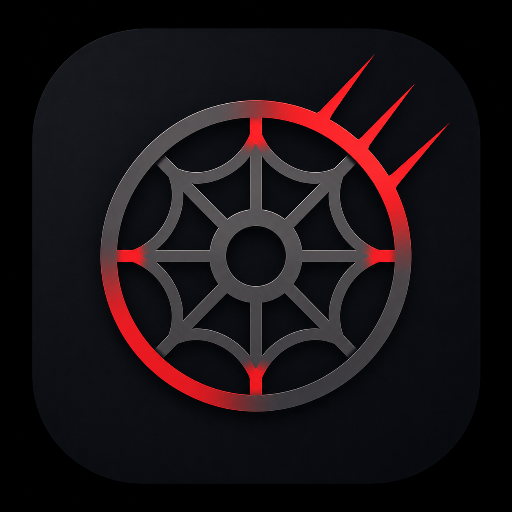
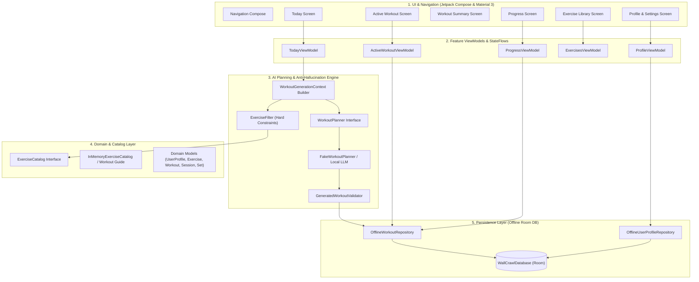
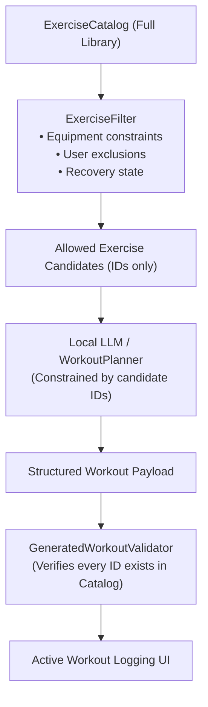

<p align="center">
  
</p>

<h1 align="center">WallCrawl</h1>

<p align="center">
  <em>Local-First Intelligent Workout Planner &amp; Tracker for Android</em>
</p>

<p align="center">
  <a href="LICENSE"></a>
  <a href="https://android.com"></a>
  <a href="https://kotlinlang.org"></a>
  <a href="https://developer.android.com/jetpack/compose"></a>
  <a href="https://developer.android.com/training/data-storage/room"></a>
  <a href="#"></a>
  <a href="#"></a>
</p>

> **"Open the app → WallCrawl understands your goals, equipment, and recovery → an on-device model plans your training → zero latency, 100% offline."**

WallCrawl is an open-source, local-first Android application designed for intelligent workout planning, friction-free set tracking, and progressive overload optimization.

Instead of rigid spreadsheets or generic static routines, WallCrawl evaluates your available equipment, training split, recovery state, and muscle priorities to generate tailored daily routines using on-device intelligence—all wrapped in an athletic Spider-Man-inspired obsidian and scarlet interface with zero required cloud accounts or telemetry.

---

## 🏛️ Architecture Overview

WallCrawl is built with clean layered architecture, unidirectional data flow (UDF), Kotlin Coroutines & Flow, Jetpack Compose, Material 3, and Room.

```text
User Profile + Equipment + Workout History → Candidate Constraint Filter → On-Device Planner → Anti-Hallucination Validator → Workout UI
```



---

## 🛡️ Anti-Hallucination AI Architecture

A core design requirement of WallCrawl is that **on-device LLMs (Gemma, Qwen, LiteRT) must choose workouts, but can NEVER invent exercises**.



1. **User Profile & State Assembly**: Equipment, excluded exercises, muscle priorities, target duration, and recovery history are assembled into `WorkoutGenerationContext`.
2. **Hard Constraint Filtering**: `ExerciseFilter` filters the full `ExerciseCatalog` to produce only candidates the user can physically execute given available equipment and exclusions.
3. **Constrained Selection**: Only the filtered candidate list is supplied to `WorkoutPlanner`. When local LLMs are integrated, constrained decoding or tool-calling will constrain model tokens strictly to valid `exerciseId` strings.
4. **Strict Schema & Catalog Validation**: `GeneratedWorkoutValidator` verifies that every generated exercise ID exists in the catalog and belongs to the allowed candidates. If an unrecognized ID or invalid rep range is returned, validation throws a `WorkoutValidationException` and rejects the payload immediately.

---

## 🕷️ Spider-Man Inspired Color Palette

WallCrawl features an athletic, dark-mode design system with colors inspired by Spider-Man's iconic suit aesthetics:

| Token | Hex Value | Role in App |
| :--- | :--- | :--- |
| `SpiderRedPrimary` | `#E81A21` | Primary action buttons, brand accents, icon mark |
| `SpiderRedVibrant` | `#FF2A3A` | High-energy highlights and active indicators |
| `SpiderRedDeep` | `#9E0012` | Container backgrounds and subtle deep red states |
| `SpiderBluePrimary` | `#0066FF` | Iconic suit contrast blue for tags and analytics |
| `SpiderBlueElectric` | `#38BDF8` | Web strand glow, badges, and secondary highlights |
| `ObsidianBlack` | `#08090C` | Deep midnight black background |
| `GraphiteSurface` | `#131722` | Dark suit surface cards with subtle blue-black tone |
| `TextWebSilver` | `#E2E8F0` | High-contrast readable typography |

---

## 📁 Package & Module Structure

```text
wallcrawl.elopenmike.com/
├── WallCrawlApplication.kt         # Application container & dependency registration
├── MainActivity.kt                 # Single activity host with Edge-to-Edge Compose
├── app/
│   ├── WallCrawlNavigation.kt     # App navigation routes & bottom navigation graph
│   └── WallCrawlApp.kt            # App scaffold and bottom navigation host
├── core/
│   ├── model/                     # Pure domain models (Exercise, Workout, UserProfile, Sets)
│   ├── database/                  # Room entities, DAOs, converters, and offline repositories
│   │   ├── entity/                # UserProfileEntity, WorkoutSessionEntity, WorkoutSetEntity
│   │   ├── dao/                   # UserProfileDao, WorkoutSessionDao, WorkoutSetDao
│   │   ├── relation/              # WorkoutSessionWithExercisesAndSets
│   │   ├── converter/             # RoomTypeConverters
│   │   └── repository/            # OfflineWorkoutRepository, OfflineUserProfileRepository
│   ├── exercise/                  # Exercise catalog abstractions & candidate filtering engine
│   │   ├── ExerciseCatalog.kt     # Catalog interface (search, by ID, muscles, equipment)
│   │   ├── InMemoryExerciseCatalog.kt # Seed catalog with 12 structured exercises
│   │   └── ExerciseFilter.kt      # Hard constraint filtering (equipment, exclusions)
│   ├── ai/                        # Local AI planning & anti-hallucination validation
│   │   ├── WorkoutPlanner.kt      # AI planner interface
│   │   ├── FakeWorkoutPlanner.kt  # Recommendation engine conforming to candidate IDs
│   │   └── GeneratedWorkoutValidator.kt # Strict schema and catalog ID validation
│   └── ui/                        # Design system & reusable Compose components
│       ├── theme/                 # Color (Red #E81A21, Blue #0066FF, Obsidian #08090C), Type, Theme
│       └── components/            # WallCrawlButton, WallCrawlCard, ExerciseVisual, SetRow, WebBackgroundPattern
└── feature/
    ├── today/                     # Today recommendation card, active banner, regeneration
    ├── workout/                   # Live workout logging, set completion, celebration summary
    ├── progress/                  # Consistency streaks, volume totals, PRs, strength trends
    ├── exercises/                 # Exercise catalog browser, filter chips, detail sheets
    └── profile/                   # Goals, equipment, duration, weight units, muscle priorities
```

---

## 🏋️ Integration with Workout Guide

WallCrawl's `Exercise` domain model is designed for 1-to-1 compatibility with the open-source [Workout Guide](https://github.com/bryllim/workout-guide) exercise catalog:
- **Standardized Schema**: `id`, `name`, `primaryMuscles`, `secondaryMuscles`, `equipment`, `type`, and `imageFrames`.
- **Extensible Training Metadata**: `movementPattern`, `difficulty`, `compoundOrIsolation`, `recommendedRepRange`, and `fatigueScore`.
- **Encapsulated Visuals**: The reusable `ExerciseVisual` composable encapsulates visual presentation, enabling seamless bundling of Workout Guide SVG vector frame animations without touching screen logic.

---

## 📱 Core Features

* 🎯 **Dynamic AI Daily Recommendation**: Generates tailored push/pull/legs/upper/lower splits matching your goal, equipment, and duration targets.
* 🔄 **On-Demand Re-Planning**: Call `WorkoutPlanner` at any time to generate an alternate valid workout.
* 📝 **Zero-Latency Set Logging**: Editable weight and rep inputs with auto-save per set so active workouts survive process death.
* 🏆 **Workout Complete Celebration**: Immediate summary of duration, sets completed, volume lifted, and new PRs achieved.
* 📈 **Progress & Streaks**: Weekly consistency counter, total volume distribution, strength progression trends, and chronological history.
* 🔍 **Exercise Library**: Instant search, muscle filter chips, equipment filter chips, and modal sheets with movement pattern details.
* ⚙️ **Customizable Training Profile**: Edit goals (Build Muscle, Strength, Fat Loss, Athletic), duration (30–90m), units (lb/kg), equipment inventory, and muscle priority levels.
* 🕷️ **Spider-Man Athletic Dark Design**: Obsidian dark surfaces, vivid scarlet red accents (`#E81A21`), royal web blue highlights (`#0066FF`), and subtle agile web geometric motifs.

---

## 🧪 Testing & Verification

The project includes automated unit tests covering all critical boundaries:

```bash
# Run all unit tests
./gradlew testDebugUnitTest

# Build debug APK
./gradlew assembleDebug
```

---

## 🚀 Future Roadmap

- [ ] **On-Device Local LLM Runtime**: Quantized Gemma / Qwen execution via LiteRT / MediaPipe GenAI directly on Android NPU/GPU.
- [ ] **Workout Guide Asset Bundling**: Direct bundling of upstream SVG animation frame assets.
- [ ] **Wear OS & Health Connect**: Live wrist heart-rate tracking, rest timer vibrations, and Health Connect session export.
- [ ] **Periodization & Mesocycles**: Multi-week progression blocks, fatigue monitoring, and automated deload weeks.
