<p align="center">
  
</p>

# WallCrawl

WallCrawl is an open-source, local-first workout planner and progress tracker
for Android. It is building toward a private on-device coach that chooses
workouts from a constrained exercise catalog, while workout data stays on the
phone.

This repository currently contains the working application around that future
model: first-run onboarding with conservative equipment defaults, profile
constraints and local movement-capability inputs, a complete bundled catalog,
structured workout generation and
validation, reusable custom workout templates, type-aware active set logging
with no fabricated starting loads, Room persistence, workout-history context,
and progress calculations. The current `FakeWorkoutPlanner` is deliberately
replaceable; no production local LLM runtime is integrated yet.

## Screenshots & App Experience

### Dark & Light Theme Modes

WallCrawl supports **Dark Theme** (stealth suit graphite aesthetic), **Light Theme** (high-contrast daylight athletic), and **System Default** across every screen with dynamic insets, high-contrast SVG exercise frames, and a live switcher in Settings.

<p align="center">
  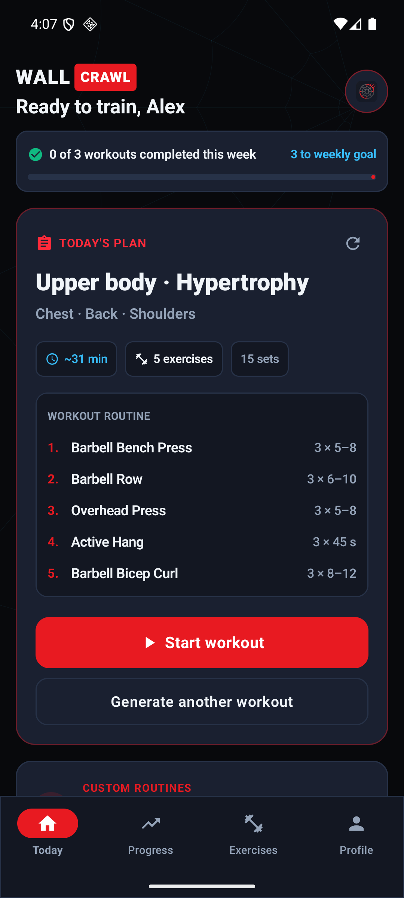
  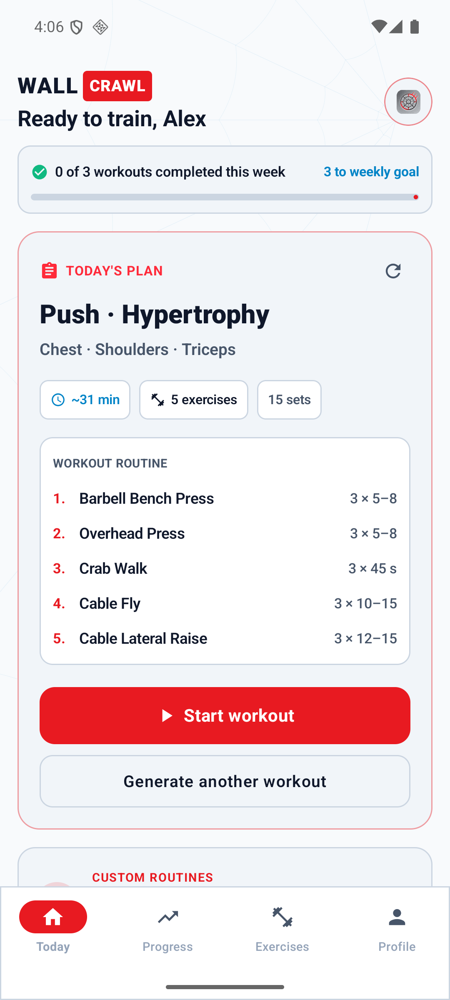
  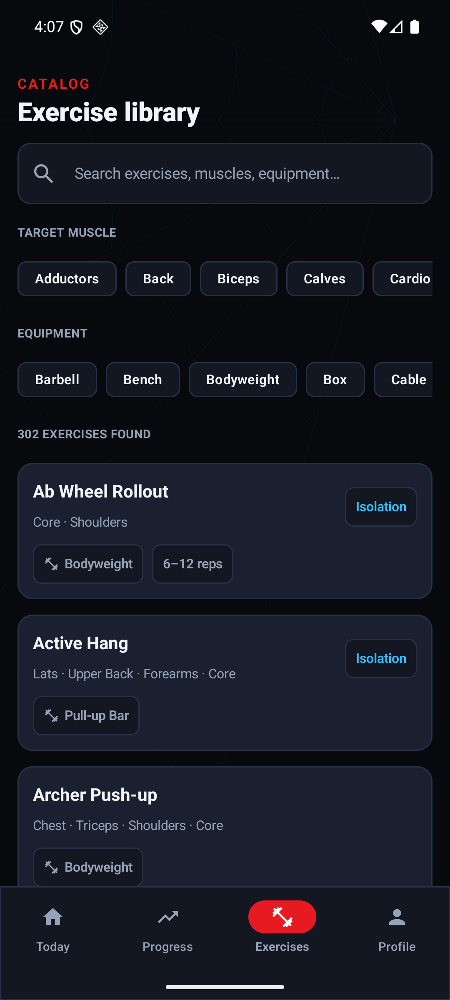
  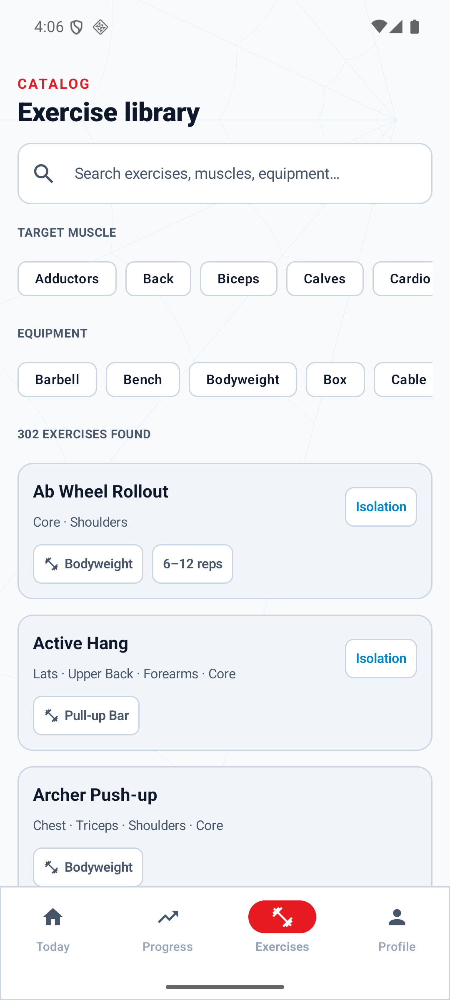
</p>
<p align="center">
  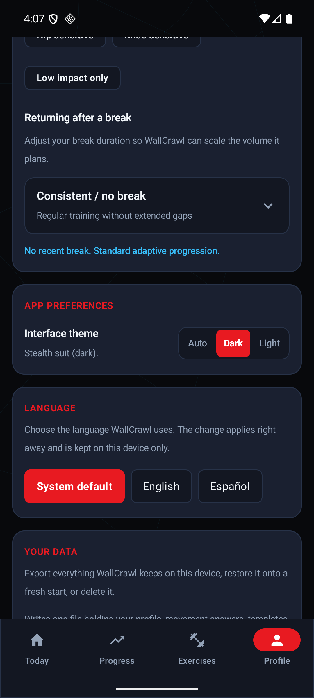
  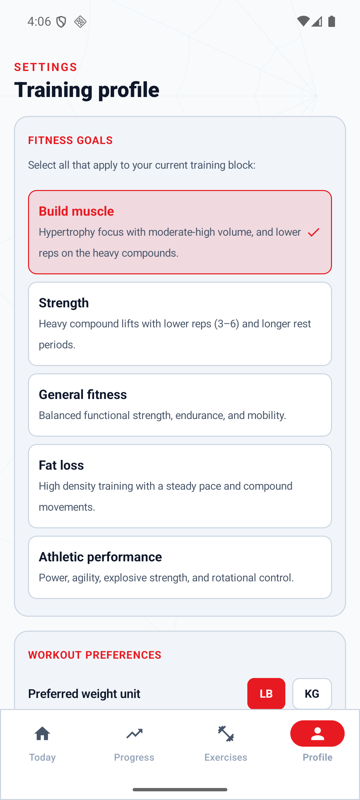
  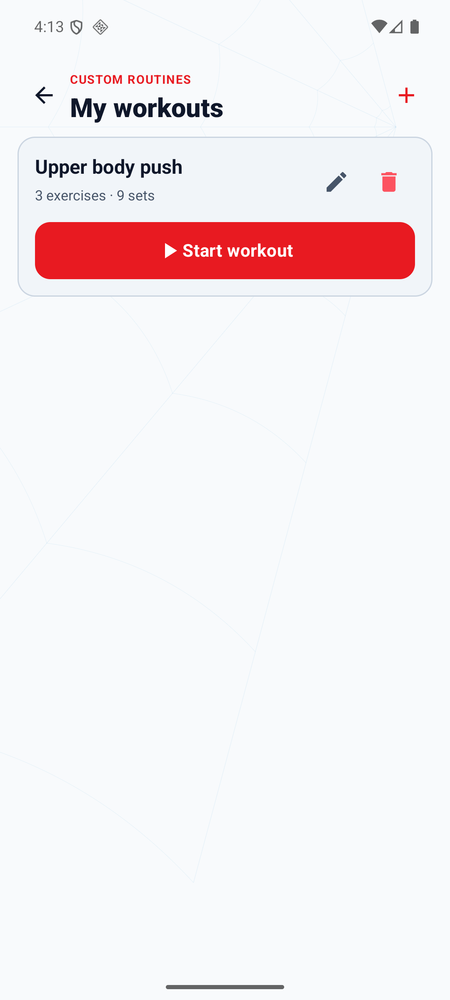
  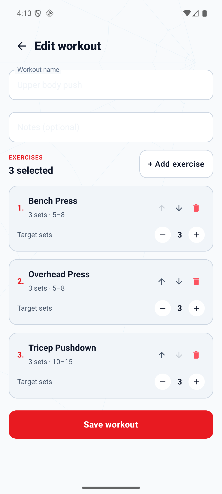
</p>
<p align="center">
  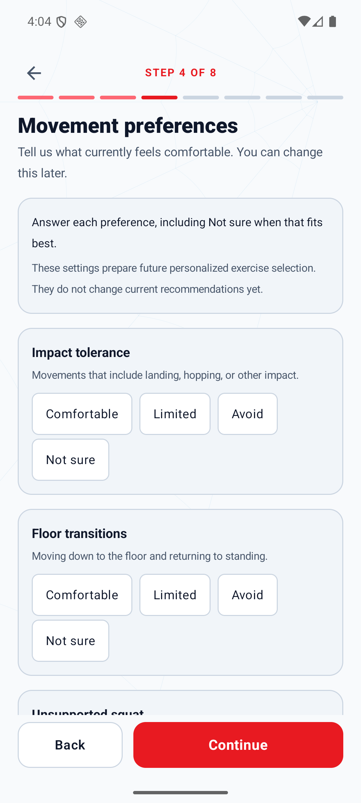
  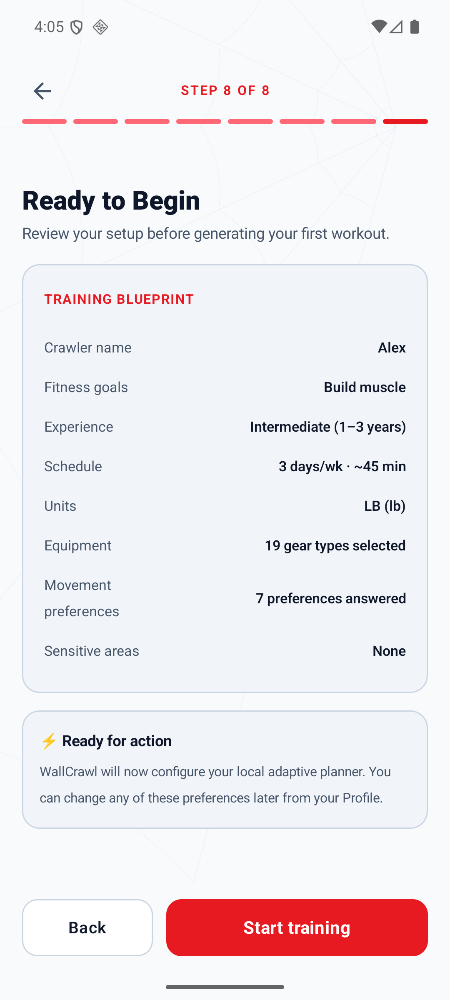
  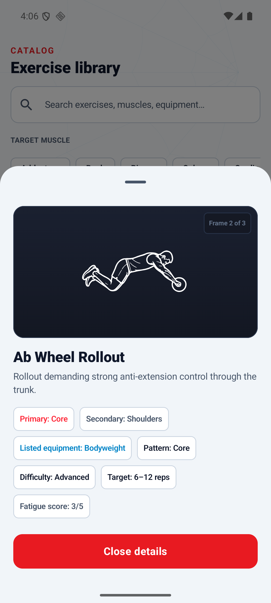
  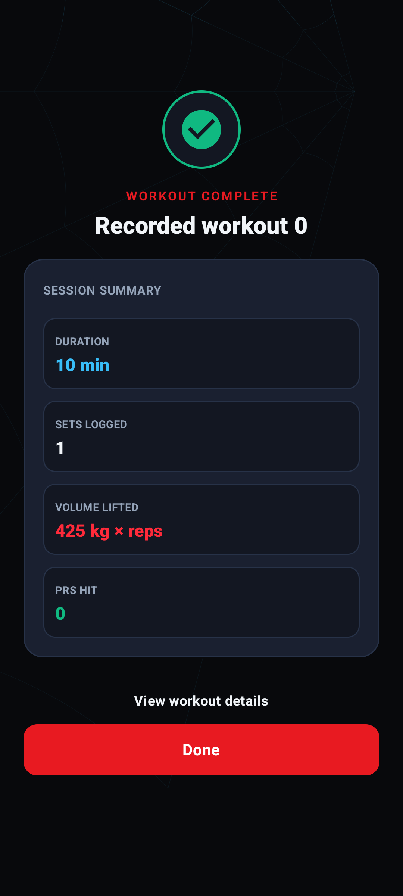
</p>

- **Today Recommendation**: Offline planner-generated routine tailored to equipment and training goals, with instant regeneration and custom routine shortcuts.
- **My Workouts & Templates**: Manage and launch saved custom routines with total sets, exercise counts, and quick-start actions.
- **Custom Workout Builder**: Interactive routine editor with full 302-exercise bottom sheet picker, drag/reorder controls, and type-aware target set steppers.
- **Exercise Library**: Searchable catalog of 302 exercises across all muscle groups and equipment types.
- **Active Workout Session**: Type-aware logging for load/reps, bodyweight reps, assisted reps, duration, and distance/duration, with one-tap set completion, plus/minus and text entry for every value, a local rest countdown, optional RPE/RIR, animated SVG movement previews, and previous performance comparisons.
- **Workout Summary**: Post-workout card displaying session duration, total volume lifted, sets completed, and personal records set against your logged history.
- **Progress Tracking**: Weekly workout streaks, volume and rep totals, per-muscle weekly set counts, strength progression indicators, and historical workout logs.
- **Training Profile & App Preferences**: Full local customization of theme preference (Auto System / Dark Mode / Light Mode) with compact switcher, multi-select fitness goals, preferred weight units (LBS/KG), session duration targets, available gym equipment, return-after-break calibration, muscle priorities, and seven movement preferences.
- **Credits & Licenses**: In-app attribution for the bundled exercise artwork, reachable from the Training Profile screen.

## Documentation

- [Architecture](docs/architecture.md) explains the catalog, planner, template,
  persistence, logging, and history boundaries in the current application.
- [Custom Workouts](docs/custom-workouts.md) documents the user flow, full-catalog
  selection rules, frozen session snapshots, and current editor limitations.
- [Planner evaluation](docs/planner-evaluation.md) documents the versioned persona
  corpus, strict fixture validation, deterministic replay, and asserted planner
  invariants.
- The phase-specific design and implementation records under
  [`docs/superpowers/`](docs/superpowers/) provide historical decision context.

## Current vertical slice

```text
                fresh install → 8-step onboarding wizard
                                (codename, goals, units/experience,
                                 movement preferences, schedule/break,
                                 gear, safety, summary)
                                           │
                         ┌─ automatic recommendation
Bundled catalog ─────────┤  profile + bounded history
                         │            ↓
                         │  hard filter → WorkoutPlanner → validator
                         │
                         └─ manual template
                            all 302 exercises → local template
                                          │
                                          ▼
                              transactional active session
                                          │
                                          ▼
                              set logging → completed history
                                   ├─ ProgressCalculator
                                   └─ next generation context
```

A fresh install cannot skip onboarding: `UserProfile.onboardingCompleted`
starts `false`, equipment defaults to bodyweight-only rather than assuming a
full gym, and Today does not generate or render until onboarding is complete.
The 8-step wizard collects user codename, multi-select fitness goals, units and
experience level, seven movement preferences, schedule and break duration,
available gear, and sensitive-joint restrictions before compiling the initial
Training Blueprint. Every movement preference requires an explicit answer;
**Not sure** is a valid answer and persists as `UNKNOWN`.

### Movement capability inputs

WallCrawl stores seven local movement preferences: impact tolerance, floor
transitions, unsupported squat, upper-body bodyweight push, vertical pull or
hang, balance without support, and continuous activity. Each is one of
`COMFORTABLE`, `LIMITED`, `AVOID`, or `UNKNOWN` (shown as **Not sure**). They can
be edited and atomically saved from Training Profile; cancel or Back discards
the draft.

Fresh onboarding requires an explicit choice for all seven. Existing users who
upgrade from schema 7 remain onboarded and receive conservative `UNKNOWN`
values, so the upgrade does not send them through onboarding again. The values
are stored in the existing local Room profile. This milestone adds no weight,
height, BMI, age, body composition, cloud sync, analytics, Health Connect,
Wear OS, network, or LLM data flow.

The current planner deliberately ignores these values. Reviewed exercise-demand
metadata and deterministic capability eligibility are the next milestone; until
that lands, changing movement preferences does not change a recommendation.

The fake planner uses the same `WorkoutPlanner` contract intended for a future
Qwen, Gemma, or LiteRT-backed implementation. It only selects IDs from
`WorkoutGenerationContext.allowedExercises`. The validator rejects unknown or
disallowed IDs and malformed set, rep, weight, rest, name, or duration values
before any workout reaches persistence.

Manual templates use the same exercise IDs and type-aware prescriptions but do
not pass through `WorkoutPlanner`. See [WallCrawl Architecture](docs/architecture.md)
for the complete automatic and manual data flows.

## Gym-floor logging and rest timer

Logging a set is meant to survive a noisy gym floor, so the active workout screen
keeps every control large, explicit, and local.

- **One-tap completion.** Each set has a full-width completion control with
  checkbox semantics, a screen-reader label, and a 56 dp target.
- **Plus/minus plus text.** Every numeric outcome — load, assistance, reps,
  seconds, metres — has 48 dp decrease and increase controls beside a text field
  for precise values. The first press of a plus control starts from the planned
  target when one exists; it never invents a load that was never confirmed.
- **Copy previous.** When a comparable previous set actually recorded a value, a
  one-tap chip copies it in.
- **Optional effort.** RPE (0-10) and RIR (0-10) sit behind an "Add feedback
  (optional)" toggle, and a simple *felt manageable?* yes/no appears once a set
  is completed. All three are nullable: leaving them blank is a first-class
  answer, and nothing about completing a set requires them.
- **Typed skip or stop.** A set can be skipped or stopped with one of five typed
  reasons, including a plainly worded "Something hurt, so I stopped". That
  reason records only the user's decision — it is never a symptom report, an
  injury, or a diagnosis, and there is no free-text field.
- **Rest countdown.** Completing a set starts a countdown from that exercise's
  own persisted `restSeconds`, with add-30-seconds, skip, and dismiss. It is
  driven by a monotonic elapsed-realtime deadline, so backgrounding the app or
  changing the device clock cannot make it drift. It survives recomposition and
  rotation, and resets to idle after process death rather than restoring a
  deadline that no longer means anything. No foreground service, notification,
  or alarm is involved.
- **Safe finishing.** Finishing with unlogged sets asks first and says how many;
  discarding a workout asks first too. Only completed sets count toward volume,
  history, and progress — skipped, incomplete, and discarded work never looks
  finished.

Everything above stays on the device. The feedback is stored so a future
deterministic engine has honest history to read; progression and deload logic do
not consume it yet.

## Architecture

The Android app uses Kotlin, Jetpack Compose, Material 3, Navigation Compose,
Room, Coroutines, Flow/StateFlow, and Gradle Kotlin DSL.

```text
app/                    navigation and dependency container
core/model/             catalog, workout, profile/capability, and analytics domain models
core/database/          Room entities, DAOs, relations, and offline repositories
core/exercise/          catalog, hard filters, and visual-provider boundary
core/ai/                planner, context builder, history analysis, validation
core/progress/          pure progress calculations over completed sessions
core/ui/                theme and reusable Compose components
feature/onboarding/     first-run onboarding and conservative planning defaults
feature/today/          daily recommendation and regeneration
feature/templates/      local custom-workout library and editor
feature/workout/        active workout logging and completion
feature/progress/       history-derived progress UI
feature/exercises/      searchable/filterable catalog browser
feature/profile/        local goals, equipment, units, and movement preferences
```

Production uses a bundled Workout Guide catalog behind WallCrawl-owned domain
and provider interfaces. Upstream paths are not stored in `Exercise` and are
not visible to feature screens. `ExerciseVisualProvider` owns that integration
boundary, while `InMemoryExerciseCatalog` remains an injectable test fixture.

## Offline Workout Guide catalog

WallCrawl bundles the complete catalog from pinned
[Workout Guide](https://github.com/bryllim/workout-guide) commit
`ba0b709cb20430361b2cb33aaadd20998164a916`: 302 exercises and 906 SVG frames.
The installed app does not use npm, fetch catalog data, or require the upstream
repository.

```text
bundled catalog.json → WorkoutGuideCatalogStore
                     ├→ BundledExerciseCatalog → search and filters
                     └→ WorkoutGuideVisualProvider → SVG frames
                                                ↓
                                     ExerciseIllustration → Compose
```

All catalog facts are browseable and searchable by name, alias, muscle, and
listed equipment. Every bundled exercise can enter workout planning with a
structurally valid prescription appropriate to its catalog type. Legacy
`programming` metadata enriches those defaults when available; otherwise
WallCrawl uses conservative fallback targets. Its 117 authored entries cover
every muscle group with beginner options throughout. The planner draws its
compound slots from that set and prefers it when filling the rest, but it still
selects from the whole catalog, so an exercise without legacy programming can
appear in a plan with fallback targets and no coaching note.

A separate optional `reviewedMetadata` block now defines categorical input for
future deterministic eligibility. The initial 37-entry cohort is entirely
`DRAFT`, including its AI-authored rationale: it is not human-approved and does
not affect current workouts. `APPROVED` requires an explicit human-review role,
timestamp, and provenance change; pull-request approval does not change review
state. Missing or draft reviewed metadata never hides an exercise from browsing
or manual templates. See [Reviewed exercise metadata](docs/reviewed-exercise-metadata.md),
its generated [review report](docs/reviewed-exercise-metadata-review.md), and the
[human sign-off packet](docs/reviewed-exercise-metadata-human-signoff.md).

Equipment requirements are alternatives: a goblet squat resolves with either a
dumbbell or a kettlebell. Where they are stricter than the upstream listing it is
deliberate — a lift that begins with a loaded bar held over the torso requires a
rack, while a lift cleaned from the floor does not, which is why the bench press
demands one and the overhead press does not. Planner-generated workouts still
apply the user's equipment hard filter. A user building a custom workout may
explicitly select any catalog exercise, with an equipment mismatch shown as a
warning rather than silently hiding the exercise.

Upstream muscle names enter the domain through `MuscleVocabulary`, so the
planner, muscle priorities, and weekly volume all share one set of names.
It resolves upstream spellings (`Quads` → `Quadriceps`) and umbrella terms that
name several groups at once: `Posterior Chain` becomes a `Hamstrings` primary
with `Glutes` and `Lower Back` secondary. Primary muscles stay one per upstream
name because weekly set counts credit a set to every primary — expanding them
in place would report one set of lunges as three. `catalog.json` itself is left
byte-identical to what the importer produces, so `--check` still verifies it.

Cardio machines, distance work, and stretches stay browseable and usable in
custom workouts, but are not prescribed as automatic training slots. The test
is whether sets and reps mean something for the movement: a kettlebell swing is
loaded work for reps that happens to involve conditioning, and a plank is a
timed hold that does not — both are planned; treadmills and jump rope are not.

Custom workout templates are stored locally in Room. Starting a template
creates a frozen active-session snapshot, so later template edits or deletion
do not rewrite workout history. Completed measurements retain their exercise
type and feed the same history and progress pipeline used by planned workouts.
Detailed target editing and unsaved-draft process restoration are intentionally
out of scope for this phase; the editor currently saves exercise order and set
count with conservative, type-specific targets.

Each exercise resolves to three bundled frames that animate in a lightweight
`1 → 2 → 3 → 2` loop using Coil 3 with SVG support. The compact normalized
`catalog.json` derives those paths from validated source slugs and a catalog
visual specification. The exact pinned upstream metadata and per-frame
attribution remain unmodified in `upstream-manifest.json` beside the SVGs.

The importer is a Python-standard-library development tool. Point it at a clean
local Workout Guide checkout at the pinned commit:

```bash
python3 tools/workout-guide/import_catalog.py \
  --source /path/to/workout-guide

python3 tools/workout-guide/import_catalog.py \
  --source /path/to/workout-guide \
  --check
```

The import validates the exact commit, source cleanliness, IDs, metadata,
licenses, paths, frame counts, legacy programming overrides, strict reviewed
metadata schema, and reviewed graphs before atomically replacing the generated
Android asset directory. It also regenerates the deterministic human-review
report; `--check` detects catalog or report drift without writing. It copies SVG
only; the PNG counterparts would duplicate the same illustrations without
helping Android's vector rendering path.

Workout Guide visual assets are CC BY-SA 4.0. Its `LICENSE`,
`LICENSE-ASSETS`, `ATTRIBUTION.md`, full `upstream-manifest.json`, pinned commit,
and WallCrawl notice are preserved under
`app/src/main/assets/workout-guide/`. WallCrawl source code remains covered by
the repository's MIT license; third-party assets retain their own terms.

The license also requires the credit to reach the person using the app, not
only someone reading this repository. **Training Profile → Credits & Licenses**
shows the creator, the license and a link to it, the pinned upstream commit,
and the bundled notices — including the Everkinetic provenance of the original
artwork. Catalog provenance is carried through `CatalogAttribution` rather than
discarded at parse, so that screen renders what actually shipped.

## Build and test

Requirements:

- JDK 17 (the project compiles to Java 17 bytecode)
- Android SDK 35
- `JAVA_HOME` and `ANDROID_HOME` configured

```bash
./gradlew testDebugUnitTest
./gradlew assembleDebug
./gradlew connectedDebugAndroidTest
python3 -m unittest discover -s tools/workout-guide -p 'test_*.py' -v
```

The importer suites run in CI alongside the Gradle build. One exercises the importer
against synthetic fixtures; the other checks the reviewed metadata that actually ships,
so a bad edit fails there rather than becoming a workout nobody can perform.

## Release versioning

Tagged builds derive Android package metadata automatically. The release workflow uses
its monotonically increasing GitHub Actions run number as `versionCode` and the tag
without its leading `v` as `versionName`, then passes both to Gradle. It verifies the
generated APK metadata before publishing. Local builds default to `versionCode` 1 and
`versionName` `0.1.0-dev`; they are not release identifiers.

GitHub numbers runs per workflow. If `.github/workflows/release.yml` is replaced rather
than edited in place, preserve a `versionCode` greater than the latest distributed build
before publishing from the replacement workflow.

GitHub prereleases are currently debug-signed and intentionally require uninstalling
the previous CI build. Supporting in-place upgrades also requires a stable release
signing key; version metadata alone cannot make differently signed APKs compatible.

The unit suite covers catalog filtering, context construction, capability
normalization and persistence, onboarding/Profile drafts, planner invariance,
bounded history
analysis, planner constraints and type-aware prescriptions, split selection and
its failure reasons, the muscle vocabulary and the shipped catalog's conformance
to it, generated-workout validation, template validation, atomic persistence
boundaries, progress and personal-record calculations, attribution loading,
Today state, duration calculation, and visual-provider mapping.
Android instrumentation also validates database migrations through schema 8,
capability-control semantics, and template/session
snapshot behavior, parses the packaged 302-exercise catalog, and opens every one
of its 906 SVG paths.

## Product and engineering principles

- Core workout planning and tracking should work offline without an account.
- A fresh install must complete explicit onboarding before it can reach
  automatic planning; nothing about equipment, experience, or gym access is
  assumed on its behalf.
- A future model chooses the workout, but only inside a deterministic legal
  exercise set created from equipment, exclusions, and hard limitations.
- Model output is structured and always validated before persistence or UI.
- No unconfirmed starting load is ever prescribed: a `WEIGHT_REPS` target
  weight comes only from bounded history or a load the user explicitly
  confirmed, never a sample or catalog default.
- Recommendation and performed values are both retained for future progression.
- Each session retains its weight unit; mixed-unit history is converted only for
  planner and analytics calculations, never silently relabeled.
- Analytics are derived from completed local sessions, not sample metrics.
- Movement-capability values are currently validated local profile inputs only;
  they do not affect filtering, ranking, substitutions, or dose yet.
- Database migrations must preserve user history; destructive migration fallback
  is intentionally disabled.

## Next milestones

- Complete human review of the 37-entry categorical draft cohort, then add
  reviewed-only deterministic capability eligibility before any
  capability-aware filtering or ranking is enabled.
- Gate exercise difficulty on the profile's experience level. The data now
  exists across every muscle group; nothing reads it yet, so a beginner can still
  be led with a lift marked advanced.
- Make `recommendedRepRange` optional so timed holds can be reviewed. Fourteen
  planner-eligible movements — planks, dead hangs, wall sits — cannot carry
  mechanics, fatigue, or a coaching note today, because the schema demands a rep
  range their prescriptions never read.
- Review the exercises the planner reaches for outside the reviewed set, and add
  band coverage: a band-only profile is served almost entirely by unreviewed
  entries.
- Continue reviewing programming metadata beyond the planner's working set, so
  browsing and custom workouts benefit from it too.
- Consume the logged RPE/RIR, manageable confirmation, and typed stop reasons in
  progression and deload decisions; they are captured and stored today, but no
  planning logic reads them yet.
- Add exercise substitution to the active workout.
- Expand progress calculations and charts as more history accumulates.
- Integrate a constrained on-device model only after the surrounding pipeline is
  production-ready.
- Later: Health Connect, Wear OS, programs/periodization, optional sync, and
  model management.
