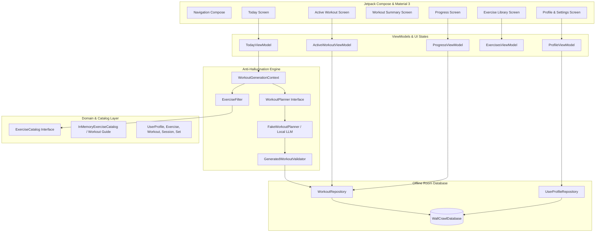

# WallCrawl 🕷️

> **Local-first intelligent workout planner and tracker for Android.**

WallCrawl learns your goals, available equipment, workout history, and recovery to generate optimized daily training routines using on-device intelligence. Follow workouts in a focused, dark athletic interface, log sets with zero latency, and let your training history guide future recommendations—100% offline.

---

## 🏗️ Product Vision & Philosophy

* **Local-First & Offline**: Your fitness data, history, and AI recommendation engines run entirely on your device with Room persistence and zero required cloud dependencies.
* **Intelligent & Adaptive**: Instead of rigid static spreadsheets or generic boilerplate routines, workouts dynamically adjust based on your goals, volume distribution, and equipment.
* **Agile & Athletic Aesthetics**: Dark obsidian surfaces, graphite cards, crimson red accents, and subtle web geometric motifs without copyrighted IP.
* **Open & Extensible**: Built on top of modular Android architecture ready to bundle community exercise catalogs like [Workout Guide](https://github.com/bryllim/workout-guide) and on-device LLMs (Gemma, Qwen, LiteRT).

---

## 🏛️ Architecture Overview

WallCrawl follows modern Android Clean Architecture with unidirectional data flow (UDF), Kotlin Coroutines & Flow, Jetpack Compose, Material 3, and Room.



---

## 📁 Package & Module Responsibilities

```text
wallcrawl.elopenmike.com/
├── WallCrawlApplication.kt         # Application container & dependency registration
├── MainActivity.kt                 # Single activity host with Edge-to-Edge Compose
├── app/
│   └── WallCrawlNavigation.kt     # App navigation graph & bottom bar definitions
│   └── WallCrawlApp.kt            # App scaffold and bottom navigation host
├── core/
│   ├── model/                     # Pure domain models (Exercise, Workout, UserProfile, Sets)
│   ├── database/                  # Room entities, DAOs, converters, and offline repositories
│   │   ├── entity/                # UserProfileEntity, WorkoutSessionEntity, WorkoutSetEntity
│   │   ├── dao/                   # UserProfileDao, WorkoutSessionDao, WorkoutSetDao
│   │   ├── relation/              # WorkoutSessionWithExercisesAndSets
│   │   ├── converter/             # RoomTypeConverters
│   │   └── repository/            # OfflineWorkoutRepository, OfflineUserProfileRepository
│   ├── exercise/                  # Exercise catalog abstractions & candidate filtering engine
│   │   ├── ExerciseCatalog.kt     # Catalog interface (search, by ID, muscles, equipment)
│   │   ├── InMemoryExerciseCatalog.kt # Seed catalog with 12 structured exercises
│   │   └── ExerciseFilter.kt      # Hard constraint filtering (equipment, exclusions)
│   ├── ai/                        # Local AI planning & anti-hallucination validation
│   │   ├── WorkoutPlanner.kt      # AI planner interface
│   │   ├── FakeWorkoutPlanner.kt  # Smart recommendation engine conforming to candidate IDs
│   │   └── GeneratedWorkoutValidator.kt # Strict schema and catalog ID validation
│   └── ui/                        # Design system & reusable Compose components
│       ├── theme/                 # Color, Type, Theme (Obsidian dark, Crimson red)
│       └── components/            # WallCrawlButton, WallCrawlCard, ExerciseVisual, SetRow, WebBackgroundPattern
└── feature/
    ├── today/                     # Today recommendation card, active banner, regeneration
    ├── workout/                   # Live workout logging, set completion, celebration summary
    ├── progress/                  # Consistency streaks, volume totals, PRs, strength trends
    ├── exercises/                 # Exercise catalog browser, filter chips, detail sheets
    └── profile/                   # Goals, equipment, duration, weight units, muscle priorities
```

---

## 🛡️ Anti-Hallucination AI Architecture

A core design requirement of WallCrawl is that **on-device LLMs must choose workouts, but can NEVER invent exercises**.

### Generation Pipeline:
1. **User Profile & State Assembly**: Equipment, excluded exercises, muscle priorities, target duration, and recovery history are assembled into `WorkoutGenerationContext`.
2. **Hard Constraint Filtering**: `ExerciseFilter` filters the full `ExerciseCatalog` to produce only candidates the user can physically execute given available equipment and exclusions.
3. **Constrained Selection**: Only the filtered candidate list is supplied to `WorkoutPlanner`. When local LLMs (Gemma/Qwen) are integrated, constrained decoding or tool-calling will constrain model tokens to valid `exerciseId` strings.
4. **Strict Schema & Catalog Validation**: `GeneratedWorkoutValidator` verifies that every generated exercise ID exists in the catalog and belongs to the allowed candidates. If an unrecognized ID or invalid rep range is returned, validation throws a `WorkoutValidationException` and triggers re-generation rather than corrupting user logs.

---

## 🏋️ Integration with Workout Guide

WallCrawl's `Exercise` domain model is designed for 1-to-1 compatibility with the open-source [Workout Guide](https://github.com/bryllim/workout-guide) exercise catalog:
- Standardized fields: `id`, `name`, `primaryMuscles`, `secondaryMuscles`, `equipment`, `type`, and `imageFrames`.
- Extensible metadata: `movementPattern`, `difficulty`, `compoundOrIsolation`, `recommendedRepRange`, and `fatigueScore`.
- Reusable `ExerciseVisual` composable encapsulates visual presentation, enabling seamless bundling of Workout Guide SVG vector frame animations in future releases without touching screen logic.

---

## 📱 Features in v0.1

| Screen | Core Capabilities |
| :--- | :--- |
| **Today** | Dynamic AI workout suggestions, target muscles, estimated duration, exercise previews, "Start Workout" CTA, "Generate another workout" on-demand planner, and active session resumption. |
| **Active Workout** | Live set tracking (weight, reps, completion checks), target vs. previous session performance display, exercise illustration placeholders, next/previous navigation, and auto-persisting logs. |
| **Workout Complete** | Summary celebrating elapsed duration, sets completed, total volume lifted, and personal records hit. |
| **Progress** | Weekly consistency streaks, total workouts counter, weekly volume tracker, muscle volume balance, recent PRs, strength progression trends, and chronological history log. |
| **Exercise Library** | Fast search, muscle filter chips, equipment filter chips, and interactive detail sheets with movement patterns and descriptions. |
| **Profile & Settings** | Fitness goals (Build Muscle, Strength, Fat Loss, etc.), experience levels, workout duration slider, weight units (lb/kg), available equipment toggles, and muscle priority matrix. |

---

## 🧪 Testing

The repository contains automated unit tests covering domain models, catalog lookups, candidate filtering, AI generation constraints, validator security, and repository persistence:

```bash
# Run all unit tests
./gradlew testDebugUnitTest

# Assemble debug APK
./gradlew assembleDebug
```

---

## 🚀 Roadmap & Future Expansion

The architecture is built to support future features without major refactoring:
- [ ] **On-Device LLM Inference**: LiteRT / MediaPipe GenAI runtime executing quantized Gemma / Qwen models directly on Android NPU/GPU.
- [ ] **Workout Guide Asset Bundling**: Bundling upstream SVG animation frames and vector assets into the app binary.
- [ ] **Wear OS & Health Connect**: Live heart-rate synchronization, rest timer vibration on wrist, and Health Connect session export.
- [ ] **Custom Exercises**: Ability for users to add custom movements and map them to movement patterns.
- [ ] **Advanced Periodization**: Multi-week mesocycles, deload automation, and readiness signals.
- [ ] **Optional Cloud Sync**: Encrypted peer-to-peer or local backup export.
