<p align="center">
  
</p>

# WallCrawl

WallCrawl is an open-source, local-first workout planner and progress tracker
for Android. It is building toward a private on-device coach that chooses
workouts from a constrained exercise catalog, with workout data stored locally
under an explicit [backup and privacy policy](docs/privacy.md).

This repository currently contains the working application around that future
model: first-run onboarding with conservative equipment defaults, profile
constraints and local movement-capability inputs, a complete bundled catalog,
structured workout generation and
validation, reusable custom workout templates, type-aware active set logging
with no fabricated starting loads, a complete English and neutral Latin American
Spanish interface, Room persistence with user-owned export,
restore, and deletion, workout-history context,
experience-aware exercise ordering, a production-disabled reviewed capability-
evidence soft-penalty relaxation, a production-disabled reviewed state-based
dose/effort/rest policy, and progress calculations. The current
`FakeWorkoutPlanner` is deliberately replaceable; no production local LLM
runtime is integrated yet.

## Screenshots & App Experience

### Dark & Light Theme Modes

WallCrawl supports **Dark Theme** (stealth suit graphite aesthetic), **Light Theme** (high-contrast daylight athletic), and **System Default** across every screen with dynamic insets, high-contrast SVG exercise frames, and a live switcher in Settings.

<p align="center">
  
  
  
  
</p>
<p align="center">
  
  
  
  
</p>
<p align="center">
  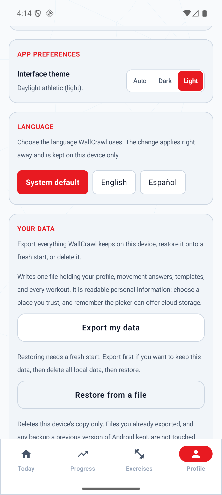
  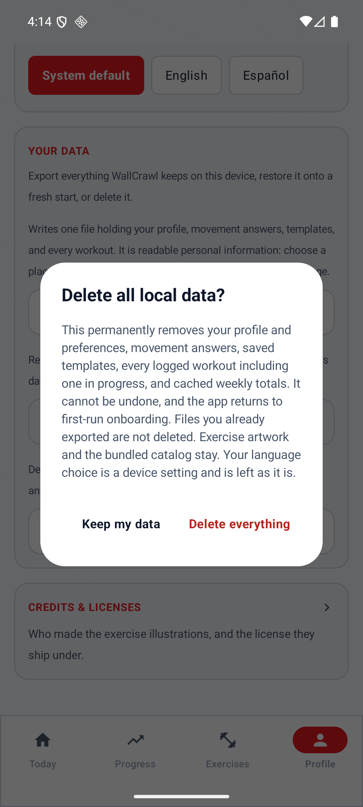
  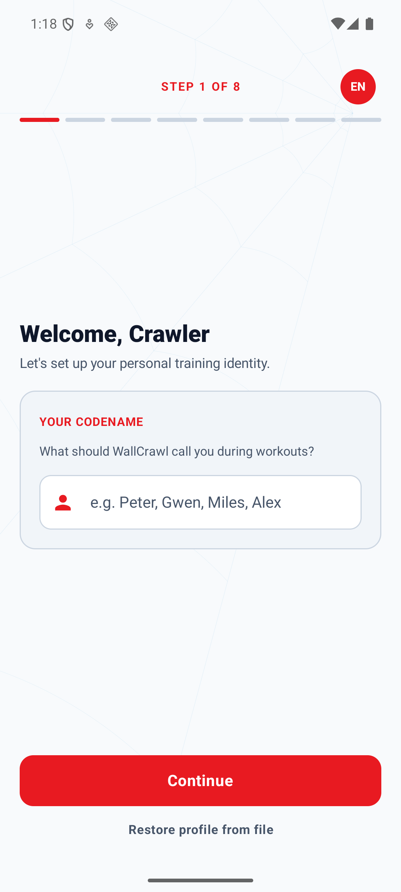
  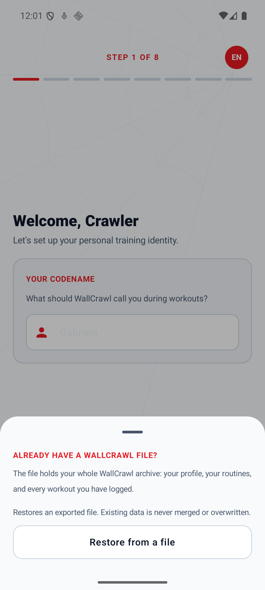
</p>
<p align="center">
  <em>Your Data on Training Profile &middot; the destructive confirmation &middot; restore offered on first run, and the sheet behind it</em>
</p>
<p align="center">
  
  
  
  
</p>

- **Today Recommendation**: Offline planner-generated routine tailored to equipment and training goals, with instant regeneration and custom routine shortcuts.
- **My Workouts & Templates**: Manage and launch saved custom routines with total sets, exercise counts, and quick-start actions.
- **Custom Workout Builder**: Interactive routine editor with full 302-exercise bottom sheet picker, drag/reorder controls, and type-aware target set steppers.
- **Exercise Library**: Searchable catalog of 302 exercises across all muscle groups and equipment types.
- **Active Workout Session**: Type-aware logging for load/reps, bodyweight reps, assisted reps, duration, and distance/duration, with one-tap set completion, plus/minus and text entry for every value, a local rest countdown, optional RPE/RIR, animated SVG movement previews, and previous performance comparisons.
- **Workout Summary**: Post-workout card displaying session duration, total volume lifted, sets completed, and personal records set against your logged history.
- **Progress Tracking**: Calendar-week logged workouts, completed sets, reps and external-load volume, with reviewed primary dose and overlapping muscle involvement clearly separated. Includes weekly streaks, strength trends, and recent history.
- **Training Profile & App Preferences**: Full local customization of app language (System default / English / Español) and theme preference (Auto System / Dark Mode / Light Mode) with compact switchers, multi-select fitness goals, preferred weight units (LBS/KG), session duration targets, available gym equipment, return-after-break calibration, muscle priorities, and seven movement preferences.
- **Your Data**: Export everything stored on the device to one versioned, checksummed file you choose the destination for; restore it onto a fresh start; or delete every local record behind an explicit destructive confirmation. Restore is also offered on the first onboarding step — a quiet button under Continue opens the whole flow in a sheet — so a reinstall does not have to build a throwaway profile first.
- **Language**: English and neutral Latin American Spanish across the whole app, following the device by default, switchable from a chip in the onboarding wizard's header before any details are entered and from Training Profile → App preferences, and stored as a device setting rather than as part of the profile or the export archive.
- **Credits & Licenses**: In-app attribution for the bundled exercise artwork, reachable from the Training Profile screen.

### Progress: activity and reviewed dose

Progress and Today's weekly workout counter use **Monday-to-Monday calendar weeks in the
device's time zone**, including daylight-saving changes. A streak needs at least one
completed workout per week; an unfinished, empty current week does not erase a streak
through last week.

Logged activity includes completed warm-ups and timed sets. Repetitions and external-load
volume are shown only where those measurements apply; volume is expressed as **lb × reps**
or **kg × reps**, never body mass or assistance weight. Muscle involvement uses each
exercise's listed primary muscles: those counts overlap and are **not a total of unique
sets**. Comparisons show the current, unfinished week against the full previous week;
without a baseline, involvement reads as new activity rather than an invented percentage.

**Reviewed primary dose** uses the existing `PRIMARY_ONLY_V1` ledger: one approved direct
primary per completed non-warm-up work set. Its details distinguish descriptive secondary
involvement from unattributed work. The current catalog remains **37 DRAFT / 0 APPROVED**,
so real workouts remain visible even when reviewed allocation is unavailable. Neither an
empty allocation nor this accounting convention measures physiological stimulus or
diagnoses readiness. See the [exact metric and read contracts](docs/weekly-dose-ledger.md#progress-metric-contract).

<p align="center">
  
  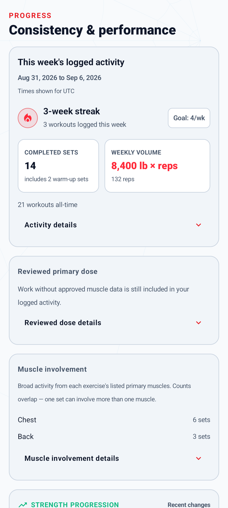
  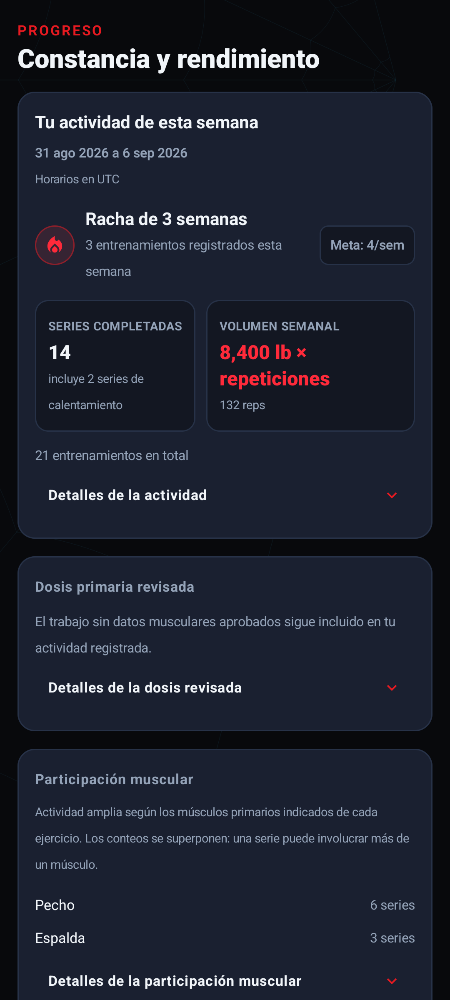
  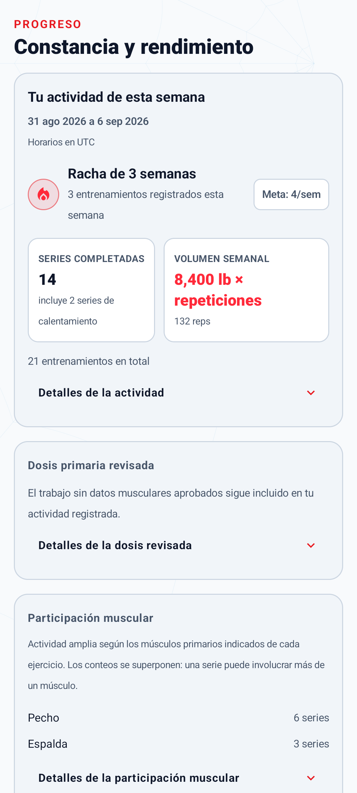
</p>
<p align="center">
  <em>Disposable example logs with no approved muscle allocation; production metadata is unchanged.</em>
</p>

### English & Spanish

Every screen ships in **English** and **neutral Latin American Spanish**, including the
302-exercise catalog, generated workout titles and explanations, destructive
confirmations, and TalkBack labels. Both languages work fully offline; nothing is
translated at runtime.

The language follows the device by default, from the very first onboarding screen. A chip
in the wizard header — reading `EN` or `ES`, whichever is actually on screen — changes it
before any details are entered, and **Training Profile → App preferences** changes it later.
Both write the same preference, and on Android 13+ that is the same per-app language the
system Settings screen shows. It is a
device setting: it is not part of the training profile, not in the export archive, and
restoring an archive never changes it.

<p align="center">
  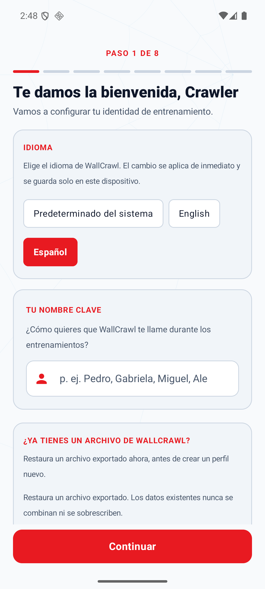
  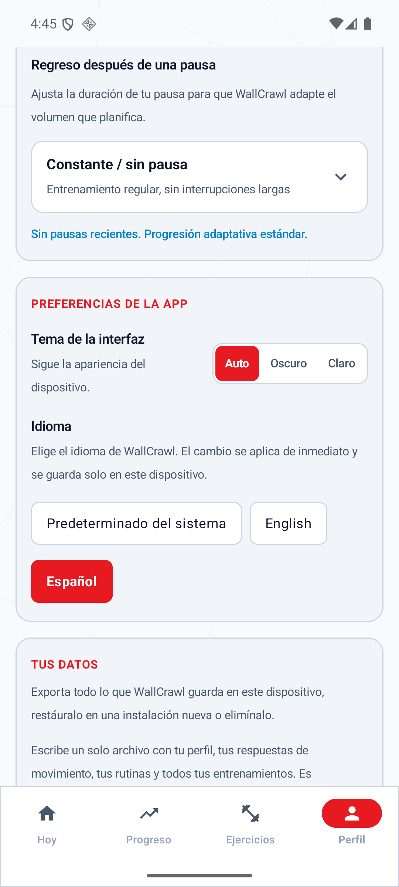
  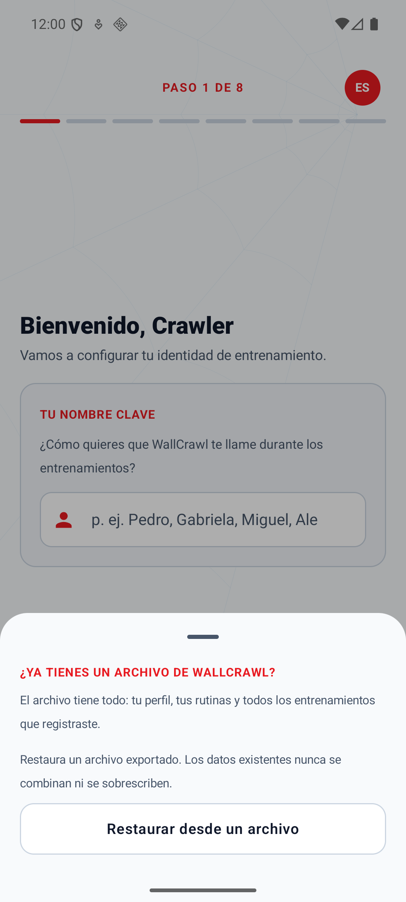
  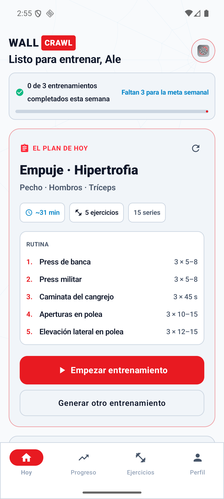
</p>
<p align="center">
  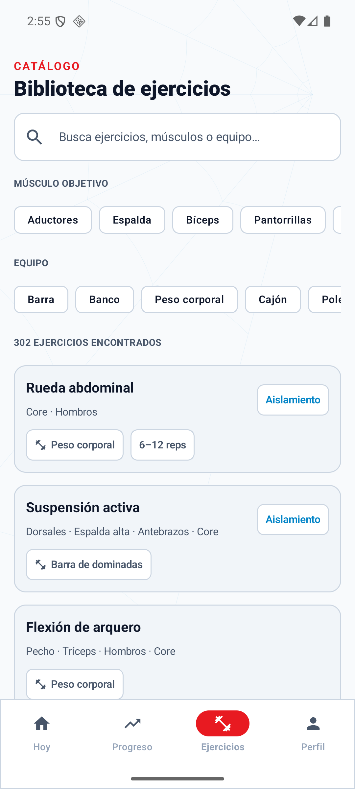
  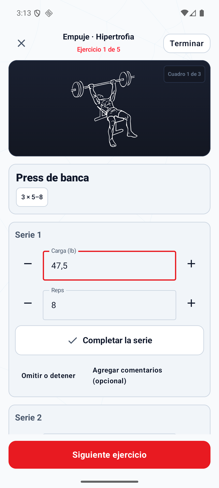
  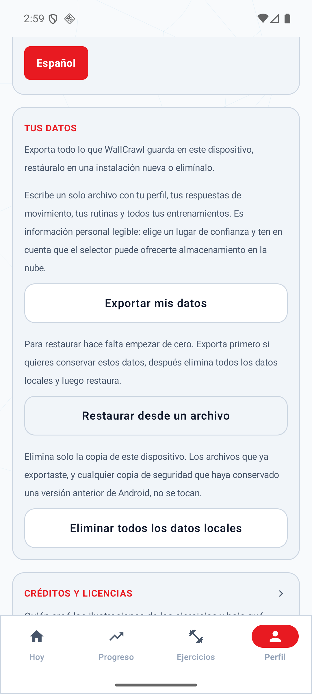
  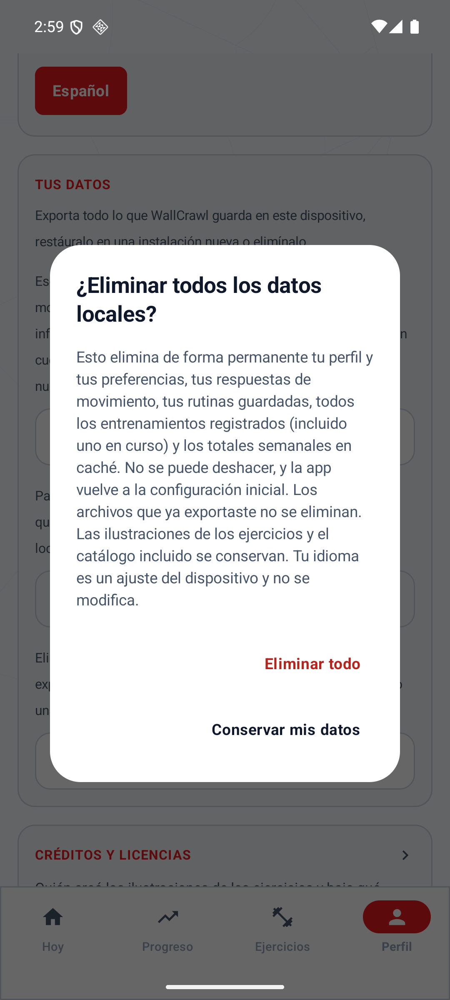
</p>
<p align="center">
  <em>Language in the wizard header and in App preferences &middot; restoring during onboarding &middot; Today, the catalog, and logging &middot; the data controls and their destructive confirmation</em>
</p>

Language is presentation only. Identical inputs produce identical exercise selections,
prescriptions, loads, rest targets, and stored measurements in either language, and units
never change with it — Spanish does not turn pounds into kilograms. Numbers are shown with
the reader's decimal mark and read back the same way, so a load typed as `47,5` is stored
as 47.5. Anything a user typed — codename, template names, notes — and the title and
explanation stored with a past session are kept exactly as written, in the language they
were written in. See [Localization](docs/localization.md) for the full reference and for
how to add a string, an exercise, or a language.

## Documentation

- [Architecture](docs/architecture.md) explains the catalog, planner, template,
  persistence, logging, and history boundaries in the current application.
- [Privacy and backup](docs/privacy.md) explains local storage, Android backup
  exclusions, user-owned export/restore/deletion, archive compatibility, recovery
  tradeoffs, and platform limitations.
- [Custom Workouts](docs/custom-workouts.md) documents the user flow, full-catalog
  selection rules, frozen session snapshots, and current editor limitations.
- [Localization](docs/localization.md) explains where each kind of text lives, what
  is deliberately never translated, the exercise-translation overlay and its
  stable-ID boundary, number and input formatting, and how to add a string, an
  exercise, or a language without translation drift.
- [Planner evaluation](docs/planner-evaluation.md) documents the versioned persona
  corpus, strict fixture validation, deterministic replay, and asserted planner
  invariants.
- The phase-specific design and implementation records under
  [`docs/superpowers/`](docs/superpowers/) provide historical decision context.

## Privacy, backup, and recovery

WallCrawl disables implicit Android cloud backup with `allowBackup="false"` and
excludes all app-data domains in both legacy backup rules and modern cloud-backup
and device-transfer rules. The policy covers profiles and capabilities, preferences,
templates, workout history and feedback, and derived ledger state. The app adds no
account, analytics upload, or cloud-sync service.

Recovery is **user-driven**. Training Profile offers three controls, and the first
onboarding step offers restore on its own:

| Control | What it does |
| --- | --- |
| Export my data | Writes one JSON archive — profile, capabilities, templates, and every session including one in progress — to a document you pick, with a format version and a SHA-256 checksum |
| Restore from a file | Reads an archive into a **fresh start only**: no workouts, no templates, onboarding unfinished. It never merges and never overwrites |
| Delete all local data | Removes every local record behind a confirmation naming what is lost, then returns to first-run onboarding |

**An export is readable personal information** — training history and movement
answers in clear text — so choose the destination deliberately; Android's picker can
offer cloud-backed providers, and the app cannot tell which you chose. The checksum
detects damage, not tampering: it is neither encryption nor proof of authenticity.

Because restore needs a fresh start, the supported route is **export → delete all
local data or reinstall → restore**. Ordinary local persistence and compatible,
same-signature in-place upgrades keep working; none of this moves or clears the Room
database on its own. **Uninstalling or clearing app storage still removes local data,
and an export you never took cannot be recovered afterwards.** Deleting local data
does not reach files you already exported, copies a provider synchronised elsewhere,
or backups an earlier Android version may still hold. Do not rely on automatic device
transfer to preserve WallCrawl data.

Android documents manufacturer-dependent device-transfer behavior, so these
exclusions are not a guarantee about every OEM migration tool. This change neither
deletes previously uploaded backups nor guarantees remote erasure. See the
[full policy and platform boundary](docs/privacy.md) before uninstalling or changing
devices.

## Current vertical slice

```text
                fresh install → 8-step onboarding wizard
                                (codename, goals, units/experience,
                                 movement preferences, schedule/break,
                                 gear, safety, summary)
                                           │
                         ┌─ automatic recommendation
Bundled catalog ─────────┤  profile + bounded history
                         │            ↓
                         │  hard filter → WorkoutPlanner → validator
                         │
                         └─ manual template
                            all 302 exercises → local template
                                          │
                                          ▼
                              transactional active session
                                          │
                                          ▼
                              set logging → completed history
                                   ├─ ProgressRepository → logged activity + reviewed ledger
                                   └─ next generation context
```

A fresh install cannot skip onboarding: `UserProfile.onboardingCompleted`
starts `false`, equipment defaults to bodyweight-only rather than assuming a
full gym, and Today does not generate or render until onboarding is complete.
The 8-step wizard collects user codename, multi-select fitness goals, units and
experience level, seven movement preferences, schedule and break duration,
available gear, and sensitive-joint restrictions before compiling the initial
Training Blueprint. Every movement preference requires an explicit answer;
**Not sure** is a valid answer and persists as `UNKNOWN`.

### Movement capability inputs

WallCrawl stores seven local movement preferences: impact tolerance, floor
transitions, unsupported squat, upper-body bodyweight push, vertical pull or
hang, balance without support, and continuous activity. Each is one of
`COMFORTABLE`, `LIMITED`, `AVOID`, or `UNKNOWN` (shown as **Not sure**). They can
be edited and atomically saved from Training Profile; cancel or Back discards
the draft.

Fresh onboarding requires an explicit choice for all seven. Existing users who
upgrade from schema 7 remain onboarded and receive conservative `UNKNOWN`
values, so the upgrade does not send them through onboarding again. The values
are stored in the existing local Room profile. This milestone adds no weight,
height, BMI, age, body composition, cloud sync, analytics, Health Connect,
Wear OS, network, or LLM data flow.

The reviewed-only deterministic path can consume these values for automatic
planning, but production composition deliberately keeps that path disabled while
every reviewed-metadata entry is still `DRAFT`. The current production
recommendation therefore remains unchanged when a movement preference changes.
Tests enable the path only with unmistakably synthetic in-memory approvals and
verify equipment, exclusions, constraints, capability `AVOID`, impact,
reviewed-state, temporary advanced-complexity rules, and capability-evidence
soft-penalty suppression without changing browse or manual-workout access.

The fake planner uses the same `WorkoutPlanner` contract intended for a future
Qwen, Gemma, or LiteRT-backed implementation. It only selects IDs from
`WorkoutGenerationContext.allowedExercises`. `ExercisePrescription` rejects
malformed set, rep, weight, rest, and duration values as it is constructed, and
`GeneratedWorkoutValidator` rejects unknown or disallowed exercise IDs, an empty
workout, a prescription type that disagrees with the catalog, and an
out-of-range session duration — all before any workout reaches persistence. The
title and explanation are structured specs rather than strings, so a planner
cannot emit free text for them at all.

### Reviewed state-based prescription policy

When tests explicitly enable reviewed eligibility, `TrainingProgramState` supplies
`PRIMARY_ONLY_V1` weekly direct-primary exposure to a pure, versioned prescription policy.
The policy can only reduce a valid base prescription: it never raises target sets or
changes/invents a load. Remaining weekly allowance is an upper-cap calculation with no
mandatory floor or automatic increment. The configured WallCrawl v1 product defaults cap
direct-primary exposure at 6/8/12 sets depending on state and cap one exercise at 2 or 4
sets; these are product values, not universal or medically optimal prescriptions.
`PRIMARY_ONLY_V1` is also a product accounting convention, not a complete physiological
dose measurement. These defaults are configurable through policy construction; user-facing
allowance, RIR-band, and rest-default editors are not shipped.

The same reviewed path adds nullable effort guidance: conservative states or a relevant
approved `LIMITED` capability use 2-4 RIR, established strength uses the configured 1-2 RIR
product target, and established general/hypertrophy uses 1-3 RIR. Automatic guidance
never targets 0 RIR/failure. Rest is classified as `SHORT`, `MODERATE`, or `LONG` and
mapped to configured 60/90/180-second defaults. A valid stored explicit per-exercise rest
preference wins and keeps its exact seconds; model/persistence support does not imply a
shipped preference-editing UI.

The policy currently caps each prescription against the supplied completed ledger, not
the aggregate proposal. Whole-program validation remains planned under the
[evidence-to-rule contract](docs/research/2026-08-29-training-science-evidence-review.md#validation-scope-clarification-2026-09-05).

Guidance is persisted with templates and frozen session snapshots in Room schema 11.
The active timer still reads the persisted exact seconds; add-time, skip, and dismiss are
one-off timer actions rather than durable preference changes. Production keeps reviewed
eligibility disabled because the bundled cohort remains 37 `DRAFT` / 0 `APPROVED`, so
today's legacy automatic prescriptions and manual template defaults are unchanged.

Manual templates use the same exercise IDs and type-aware prescriptions but do
not pass through `WorkoutPlanner`. See [WallCrawl Architecture](docs/architecture.md)
for the complete automatic and manual data flows.

## Gym-floor logging and rest timer

Logging a set is meant to survive a noisy gym floor, so the active workout screen
keeps every control large, explicit, and local.

- **One-tap completion.** Each set has a full-width completion control with
  checkbox semantics, a screen-reader label, and a 56 dp target.
- **Plus/minus plus text.** Every numeric outcome — load, assistance, reps,
  seconds, metres — has 48 dp decrease and increase controls beside a text field
  for precise values. The first press of a plus control starts from the planned
  target when one exists; it never invents a load that was never confirmed.
- **Copy previous.** When a comparable previous set actually recorded a value, a
  one-tap chip copies it in.
- **Optional effort.** RPE (0-10) and RIR (0-10) sit behind an "Add feedback
  (optional)" toggle, and a simple *felt manageable?* yes/no appears once a set
  is completed. All three are nullable: leaving them blank is a first-class
  answer, and nothing about completing a set requires them.
- **Typed skip or stop.** A set can be skipped or stopped with one of five typed
  reasons, including a plainly worded "Something hurt, so I stopped". That
  reason records only the user's decision — it is never a symptom report, an
  injury, or a diagnosis, and there is no free-text field.
- **Rest countdown.** Completing a set starts a countdown from that exercise's
  own persisted `restSeconds`, with add-30-seconds, skip, and dismiss. It is
  driven by a monotonic elapsed-realtime deadline, so backgrounding the app or
  changing the device clock cannot make it drift. It survives recomposition and
  rotation, and resets to idle after process death rather than restoring a
  deadline that no longer means anything. No foreground service, notification,
  or alarm is involved.
- **Safe finishing.** Finishing with unlogged sets asks first and says how many;
  discarding a workout asks first too. Only completed sets count toward volume,
  history, and progress — skipped, incomplete, and discarded work never looks
  finished.

Logging and evidence processing run locally; persisted data follows the
[backup and privacy policy](docs/privacy.md). Reviewed capability evidence reads a
strict subset of that history behind the production-disabled reviewed gate: two
distinct `SessionStatus.COMPLETED` sessions for the same exercise ID, with only
qualifying non-warm-up work and explicit `feltManageable == true`. Completion
and stop fields only disqualify invalid observations; they do not create
evidence on their own. Null/false manageable answers, completion alone, RPE,
and RIR do not qualify. RPE/RIR remain stored for logging and are unused by
capability evidence. Progression and deload logic still do not consume the
feedback.

## Architecture

The Android app uses Kotlin, Jetpack Compose, Material 3, Navigation Compose,
Room, Coroutines, Flow/StateFlow, and Gradle Kotlin DSL.

```text
app/                    navigation and dependency container
core/model/             catalog, workout, profile/capability, and analytics domain models
core/database/          Room entities, DAOs, relations, and offline repositories
core/exercise/          catalog, hard filters, and visual-provider boundary
core/ai/                planner, context builder, history analysis, validation
core/progress/          pure progress calculations over completed sessions
core/ui/                theme and reusable Compose components
feature/onboarding/     first-run onboarding and conservative planning defaults
feature/today/          daily recommendation and regeneration
feature/templates/      local custom-workout library and editor
feature/workout/        active workout logging and completion
feature/progress/       history-derived progress UI
feature/exercises/      searchable/filterable catalog browser
feature/profile/        local goals, equipment, units, and movement preferences
```

Production uses a bundled Workout Guide catalog behind WallCrawl-owned domain
and provider interfaces. Upstream paths are not stored in `Exercise` and are
not visible to feature screens. `ExerciseVisualProvider` owns that integration
boundary, while `InMemoryExerciseCatalog` remains an injectable test fixture.

## Offline Workout Guide catalog

WallCrawl bundles the complete catalog from pinned
[Workout Guide](https://github.com/bryllim/workout-guide) commit
`ba0b709cb20430361b2cb33aaadd20998164a916`: 302 exercises and 906 SVG frames.
The installed app does not use npm, fetch catalog data, or require the upstream
repository.

```text
bundled catalog.json → WorkoutGuideCatalogStore
                     ├→ BundledExerciseCatalog → search and filters
                     └→ WorkoutGuideVisualProvider → SVG frames
                                                ↓
                                     ExerciseIllustration → Compose
```

All catalog facts are browseable and searchable by name, alias, muscle, and
listed equipment. Every bundled exercise can enter workout planning with a
structurally valid prescription appropriate to its catalog type. Legacy
`programming` metadata enriches those defaults when available; otherwise
WallCrawl uses conservative fallback targets. Its 131 authored entries (117 rep-based and 14 timed strength entries) cover
every muscle group with beginner options throughout. The planner draws its
compound slots from that set, softly demotes work above the profile's
experience level, and prefers authored entries when filling the rest. Difficulty
never removes an otherwise-legal candidate: an exercise without legacy
programming can still appear in a plan with fallback targets and no coaching
note, and a higher-difficulty exercise remains selectable when it is the only
fillable option.

Timed strength programming now carries difficulty, mechanics, fatigue, coaching,
movement pattern, progression type, equipment, and alternatives without fabricated reps.
`recommendedRepRange` is required for rep-based metadata and must be absent or null
for duration/distance-duration metadata; generated timed records always use explicit
null. The exact 14-entry cohort is derived from the bundled catalog and actual planner
classification, including three moving timed drills. See
[Timed-hold programming](docs/timed-hold-programming.md) for the IDs and contract.
Timed prescriptions still use duration targets; existing rep metadata and per-exercise
prescriptions are unchanged. New timed metadata can affect ranking, equipment filtering,
and coaching. Stretches and pure conditioning still cannot fill strength slots.

A separate optional `reviewedMetadata` block defines categorical input for the
production-disabled deterministic eligibility gate. The initial 37-entry cohort is
entirely `DRAFT`, including its AI-authored rationale: it is not human-approved and does
not affect current workouts. `APPROVED` requires an explicit human-review role,
timestamp, and provenance change; pull-request approval does not change review state.
Missing or draft reviewed metadata never hides an exercise from browsing or manual
templates. See [Reviewed exercise metadata](docs/reviewed-exercise-metadata.md), its
generated [review report](docs/reviewed-exercise-metadata-review.md), the
[eligibility boundary](docs/reviewed-capability-eligibility.md), and the
[human sign-off packet](docs/reviewed-exercise-metadata-human-signoff.md).

Equipment requirements are alternatives: a goblet squat resolves with either a
dumbbell or a kettlebell. Where they are stricter than the upstream listing it is
deliberate — a lift that begins with a loaded bar held over the torso requires a
rack, while a lift cleaned from the floor does not, which is why the bench press
demands one and the overhead press does not. Planner-generated workouts still
apply the user's equipment hard filter. A user building a custom workout may
explicitly select any catalog exercise, with an equipment mismatch shown as a
warning rather than silently hiding the exercise.

Upstream muscle names enter the domain through `MuscleVocabulary`, so the
planner, muscle priorities, and weekly volume all share one set of names.
It resolves upstream spellings (`Quads` → `Quadriceps`) and umbrella terms that
name several groups at once: `Posterior Chain` becomes a `Hamstrings` primary
with `Glutes` and `Lower Back` secondary. Primary muscles stay one per upstream
name because weekly set counts credit a set to every primary — expanding them
in place would report one set of lunges as three. `catalog.json` itself is left
byte-identical to what the importer produces, so `--check` still verifies it.

Cardio machines, distance work, and stretches stay browseable and usable in
custom workouts, but are not prescribed as automatic training slots. The test
is whether the movement fits the existing strength classification: a kettlebell swing is
loaded work for reps that happens to involve conditioning, and a plank is a
timed hold that does not — both are planned; treadmills and jump rope are not.

Custom workout templates are stored locally in Room. Starting a template
creates a frozen active-session snapshot, so later template edits or deletion
do not rewrite workout history. Completed measurements retain their exercise
type and feed the same history and progress pipeline used by planned workouts.
Detailed target editing and unsaved-draft process restoration are intentionally
out of scope for this phase; the editor currently saves exercise order and set
count with conservative, type-specific targets.

Each exercise resolves to three bundled frames that animate in a lightweight
`1 → 2 → 3 → 2` loop using Coil 3 with SVG support. The compact normalized
`catalog.json` derives those paths from validated source slugs and a catalog
visual specification. The exact pinned upstream metadata and per-frame
attribution remain unmodified in `upstream-manifest.json` beside the SVGs.

The importer and pinned-source CI check use Python's standard library and Git.
[`tools/workout-guide/import-config.json`](tools/workout-guide/import-config.json)
owns `sourceRepository` and `sourceCommit`; the workflow reads this configuration
through the helper instead of maintaining another pin. Reproduce the CI check
from the repository root with Python 3, Git, and HTTPS access to public GitHub:

```bash
python3 tools/workout-guide/check_pinned_catalog.py
```

The helper validates configuration before starting Git, fetches the exact commit
into a fresh temporary checkout, verifies its commit and cleanliness, and runs
`import_catalog.py --source <checkout> --check`. It compares the complete committed
`app/src/main/assets/workout-guide/` bundle and
`docs/reviewed-exercise-metadata-review.md` with regenerated output. Success prints
`Workout Guide up to date` and exits zero; failures exit nonzero. Checked files
are never rewritten, and temporary checkouts are removed on success or failure.
Upstream is input data only: no dependencies or project code are run, and Git
configuration and credentials are isolated from the calling environment.

Failure diagnostics identify the stage:

- Configuration errors: fix missing or malformed fields in `import-config.json`.
  Automated checkout requires a public `https://github.com/owner/repository` URL
  without credentials, query strings, or fragments, and a full lowercase commit SHA.
- Git/start/timeout errors: check Git availability, temporary-directory permissions,
  public HTTPS connectivity, and whether the configured repository and commit exist.
  Each subprocess has a 180-second timeout; upstream unavailability fails the check.
- `Generated Workout Guide bundle or review report differs`: inspect authored
  inputs and committed output, then deliberately regenerate if the input change
  is intended. Do not change the source pin merely to silence drift.

To regenerate, or check an existing local checkout, point the importer at a clean
Workout Guide checkout at the configured commit:

```bash
python3 tools/workout-guide/import_catalog.py \
  --source /path/to/workout-guide

python3 tools/workout-guide/import_catalog.py \
  --source /path/to/workout-guide \
  --check
```

The import validates the exact commit, source cleanliness, IDs, metadata,
licenses, paths, frame counts, legacy programming overrides, strict reviewed
metadata schema, and reviewed graphs before atomically replacing the generated
Android asset directory. It also regenerates the deterministic human-review
report; `--check` detects catalog or report drift without writing. It copies SVG
only; the PNG counterparts would duplicate the same illustrations without
helping Android's vector rendering path.

Workout Guide visual assets are CC BY-SA 4.0. Its `LICENSE`,
`LICENSE-ASSETS`, `ATTRIBUTION.md`, full `upstream-manifest.json`, pinned commit,
and WallCrawl notice are preserved under
`app/src/main/assets/workout-guide/`. WallCrawl source code remains covered by
the repository's MIT license; third-party assets retain their own terms.

The license also requires the credit to reach the person using the app, not
only someone reading this repository. **Training Profile → Credits & Licenses**
shows the creator, the license and a link to it, the pinned upstream commit,
and the bundled notices — including the Everkinetic provenance of the original
artwork. Catalog provenance is carried through `CatalogAttribution` rather than
discarded at parse, so that screen renders what actually shipped.

## Build and test

Requirements:

- JDK 17 (the project compiles to Java 17 bytecode)
- Android SDK platform 37, which the app compiles against; it still targets API 35
- `JAVA_HOME` and `ANDROID_HOME` configured

Gradle, the Android Gradle Plugin, and Kotlin come from the wrapper and the version
catalog, so no local install of those is needed. `connectedDebugAndroidTest` needs a
running emulator or device; it fails with "No compatible devices connected" rather than
skipping when none is attached.

```bash
./gradlew connectedDebugAndroidTest --no-daemon \
  -Pandroid.testInstrumentationRunnerArguments.class=wallcrawl.elopenmike.com.app.BackupPolicyResourceTest
./gradlew testDebugUnitTest lint assembleDebug --no-daemon
./gradlew connectedDebugAndroidTest --no-daemon
git diff --check
python3 -m unittest discover -s tools/workout-guide -p 'test_*.py' -v
python3 tools/workout-guide/check_pinned_catalog.py
python3 -m unittest discover -s tools/release -p 'test_*.py' -v
```

Run the targeted backup guard on a dedicated API 26-30 emulator and an API 31+
emulator; it has been exercised on API 30 and 36. Use `ANDROID_SERIAL=<serial>`
to select a device when more than one is connected. Run the full connected suite
on API 36, matching CI. Do not reset or erase a shared device for these checks.
For fresh execution evidence, append `--rerun-tasks --no-build-cache` to Gradle
commands and inspect the reports under `app/build/test-results/` and
`app/build/outputs/androidTest-results/`: zero, skipped, or cached tests are not
proof that the guard passed.

`BackupPolicyResourceTest` checks installed flags and the target APK's merged
manifest, follows its XML resource references, and asserts full-domain exclusions
for legacy backup and modern cloud/device transfer. It does not just look for
source text or existing resources. Both XML resources are inspected on either API
branch; this is a packaged-configuration check, not an actual transfer or restore.
The guard has been shown to fail against the original backup-enabled manifest and
against narrowed database exclusions or a missing device-transfer section. See
[verification boundaries](docs/privacy.md#verification-boundary) for what this
does and does not establish.

Changes that add or reword user-visible text also need a Spanish translation: every
resource key, plural quantity, and format argument must match across `values/` and
`values-es/`, and every catalog exercise needs an entry in the translation overlay.
`StringResourceParityTest`, `BundledExerciseLocalizationTest`, and `SafetyCopyTest`
fail the build when they do not, so `testDebugUnitTest` is the check for this.
[Localization](docs/localization.md) describes the workflow.

The Python suites run in CI alongside the Gradle build and cover synthetic importer
and checkout fixtures plus the authored metadata that ships. Pull-request/main CI
also runs **Check catalog against pinned upstream source** before Java/Gradle setup,
using the [pinned-source check above](#offline-workout-guide-catalog) to detect drift
across the real committed bundle and generated review report.

## Release versioning

Tagged builds derive Android package metadata automatically. The release workflow uses
its monotonically increasing GitHub Actions run number as `versionCode` and the tag
without its leading `v` as `versionName`, then passes both to Gradle. It verifies the
generated APK metadata before publishing. Local builds default to `versionCode` 1 and
`versionName` `0.1.0-dev`; they are not release identifiers.

GitHub numbers runs per workflow. If `.github/workflows/release.yml` is replaced rather
than edited in place, preserve a `versionCode` greater than the latest distributed build
before publishing from the replacement workflow.

GitHub prereleases are currently debug-signed and intentionally require uninstalling
the previous CI build. Supporting in-place upgrades also requires a stable release
signing key; version metadata alone cannot make differently signed APKs compatible.
That uninstall removes local workout/profile data. Export first and restore after
installing the new build: a fresh install is exactly the empty destination a restore
needs. See the [privacy policy](docs/privacy.md#restore-prerequisites).

The unit suite covers catalog filtering, context construction, capability
normalization and persistence, onboarding/Profile drafts, planner invariance,
bounded history
analysis, planner constraints and type-aware prescriptions, split selection and
its failure reasons, the muscle vocabulary and the shipped catalog's conformance
to it, generated-workout validation, template validation, atomic persistence
boundaries, progress and personal-record calculations, attribution loading,
Today state, duration calculation, and visual-provider mapping.
Android instrumentation also validates every supported database migration chain through
schema 11 without destructive fallback, guidance persistence, the weekly-ledger DAO/repository,
capability-control semantics, template/session snapshot behavior, and the local-data archive:
its round trip from app-written state, every rejection path for untrusted documents,
transactional restore and deletion, and the destructive confirmation at a large font scale. It parses the
packaged 302-exercise catalog and opens every one of its 906 SVG paths. Pull-request/main
CI and tagged-release publication both run this connected suite on an API 36 emulator;
a tag cannot publish its prerelease unless instrumentation succeeds.

## Product and engineering principles

- Core workout planning and tracking should work offline without an account.
- A fresh install must complete explicit onboarding before it can reach
  automatic planning; nothing about equipment, experience, or gym access is
  assumed on its behalf.
- A future model chooses the workout, but only inside a deterministic legal
  exercise set created from equipment, exclusions, and hard limitations.
- Model output is structured and always validated before persistence or UI.
- No unconfirmed starting load is ever prescribed: a `WEIGHT_REPS` target
  weight comes only from bounded history or a load the user explicitly
  confirmed, never a sample or catalog default.
- Recommendation and performed values are both retained for future progression.
- Each session retains its weight unit; mixed-unit history is converted only for
  planner and analytics calculations, never silently relabeled.
- Profile experience softly ranks otherwise-comparable automatic candidates; it
  is not a permanent legality gate. The default legacy path reads
  `programming.difficulty`. The reviewed-enabled path reads only human-approved
  `reviewedMetadata.complexity`, never draft metadata.
- Analytics are derived from completed local sessions, not sample metrics.
- Movement-capability values already drive the reviewed-only automatic path's
  hard eligibility, soft preferences, evidence-backed soft-capability penalty
  suppression, and relevant limited-capability effort guidance, but production
  keeps that path disabled until human-approved metadata and an explicit
  enablement review exist. They do not affect today's production filtering,
  ranking, substitutions, dose, effort, or rest guidance.
- Database migrations must preserve user history; destructive migration fallback
  is intentionally disabled.

## Roadmap

Current status, dependency order, and upcoming work live in the
[WallCrawl roadmap](ROADMAP.md). Detailed design and implementation records remain under
[`docs/superpowers/`](docs/superpowers/) for execution context.
