# Exercise animation corrections — September 9, 2026

The 50 previously held male sequences now use AI-reviewed selections. This updates 138 app SVGs; 12 existing endpoints remain byte-identical. All three frames still play in the app.

These previews render the selected SVGs on black in a 1–2–3–2 loop at 380 ms per frame. The app-ready assets and distribution provenance are committed; high-resolution masters, source copies, rejected drafts, normalized PNGs and full generation records remain in the retained local production workspace.

AI visual review is not qualified movement-expert approval. Small contour, equipment alignment and phase-spacing variations remain. Bear crawl and crab walk show partial forward-and-return steps, and cycling uses a limited pedal arc. Full female animation review was not part of this correction pass.

Exact prompt files are retained for 82 of the 150 selected frames; historical prompt/reference gaps for the other 68 are documented in the local ledger and were not fabricated.

[Validation and selected hashes](validation.json) · [Distribution provenance](../../../../../app/src/main/assets/exercise-illustrations/provenance.json) · [Attribution](../../../../../app/src/main/assets/exercise-illustrations/ATTRIBUTION.md) · [CC BY-SA 4.0 license](../../../../../app/src/main/assets/exercise-illustrations/LICENSE-ASSETS)

Original pose-artwork reference: [Everkinetic](https://github.com/everkinetic/data). Additional source exercises and animation frames were contributed by [Bryl Lim](https://bryllim.com). The original attribution and source history remain in the distribution metadata. Native Codex Imagegen reference edits and deterministic Sharp/Potrace/SVGO processing produced the adaptations; no endorsement is implied.

## archer-push-up

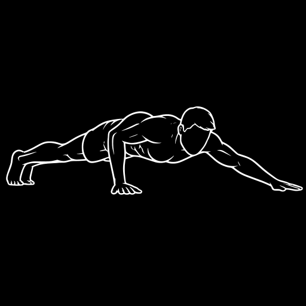

Distinct near-loaded, middle, opposite-loaded phases in fixed feet-left/head-right view; corrected source reversal. Full-scene translation registers frame3 to shared contact plane. Minor hand-outline and palm-position variation remains; no missing anatomy. PNG/SVG 3-frame sheet inspected; 1-2-3-2 GIF generated. AI visual review only.

## arm-circles

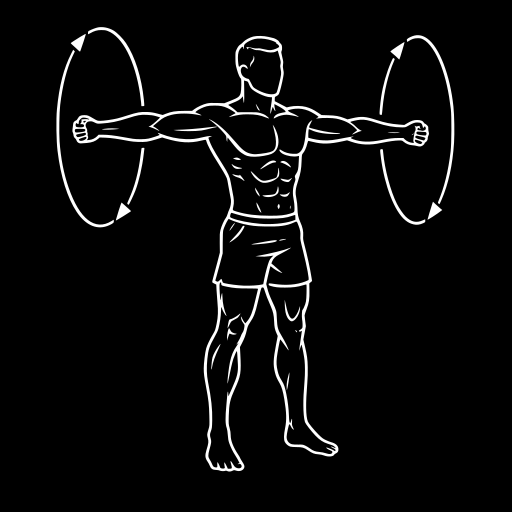

Three distinct arm positions with stable trunk and feet. Direction arrows appear only in frame1; recorded as minor annotation discontinuity.

## assault-bike

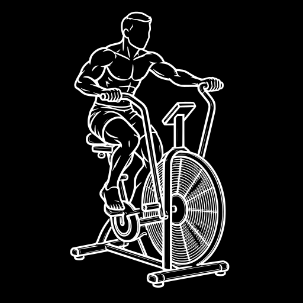

All three male phases retain broadly consistent fan/frame/seat/handle geometry and distinct pedal/leg positions. Minor head angle and contour shifts remain.

## assisted-chin-up

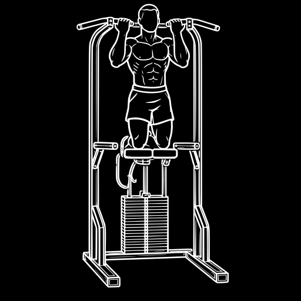

New middle2 matches fixed machine top/base and handgrips across1/2/3. Body size consistent with raised/intermediate/lowered positions and knee pad travel. Intermediate pad is closer to raised endpoint; small limb/stack contours differ. Actual SVG and PNG alpha inspected, AI visual only.

## banded-fire-hydrant

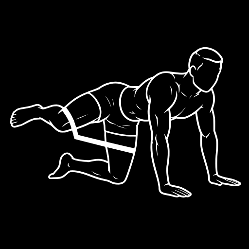

Distinct side-raised, partly lowered and knees-down phases with broadly stable hands/support knee. Minor head/torso and band contour variation remains.

## banded-pallof-press

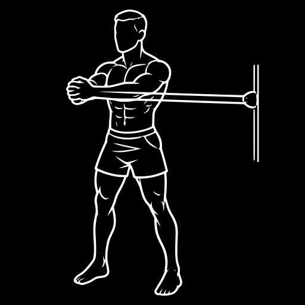

Clear extended/middle/retracted grip positions, fixed band anchor and coherent stance. Minor stance/anchor-outline variation.

## barbell-bench-press

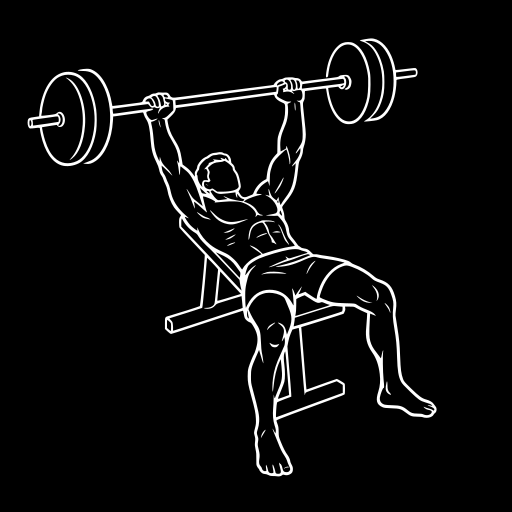

Distinct top/middle/chest-level phases with fixed bench and planted feet after uniform full-scene registration. Replaced old endpoint with head/torso drift. Minor outline differences remain. PNG and SVG compared visually; AI visual review only.

## barbell-glute-bridge

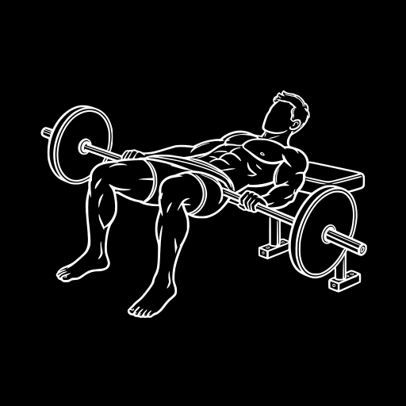

New low and midpoint retain upper-back support bench and show clear if modest hip/bar height progression with stable head/feet. Uniform containment and translation preserve full barbell travel without cropping. Minor bench pad/plate contours and small foot-position residual remain; no qualified movement approval.

## barbell-row

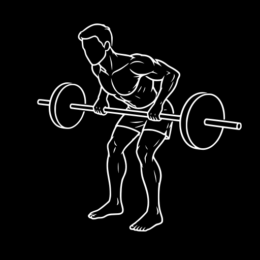

Distinct contracted/middle/extended arm phases with stable head, hinge, feet and bar dimensions.

## bear-crawl

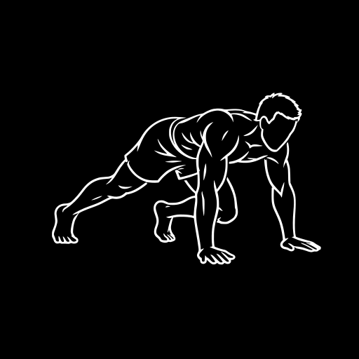

Corrected repeated static frames with native forward reach and opposite leg step. Common-canvas uniform alignment stabilizes head/torso without local anatomy warping. 1-2-3-2 shows a partial forward-and-return crawl step, not a full alternating gait cycle. Minor palm/toe contact shifts and torso contours remain; AI visual review only.

## belt-squat

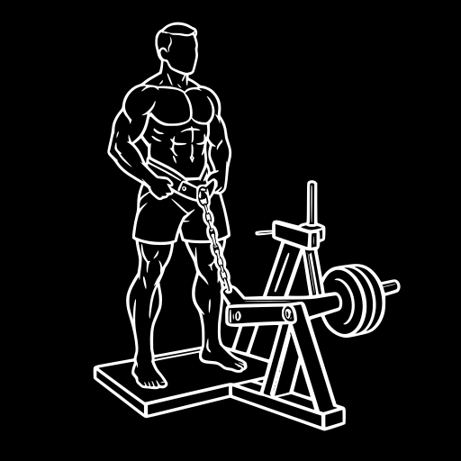

Standing halfway and deep phases now clearly differ with stable planted feet, platform, vertical post and support bases. Body proportions and facing remain consistent. Chain remains attached to hip belt and loaded lever; small linkage/contour variations remain, hardware mechanics need qualified review. SVG renders match PNGs. AI visual review only.

## bicycle-crunch

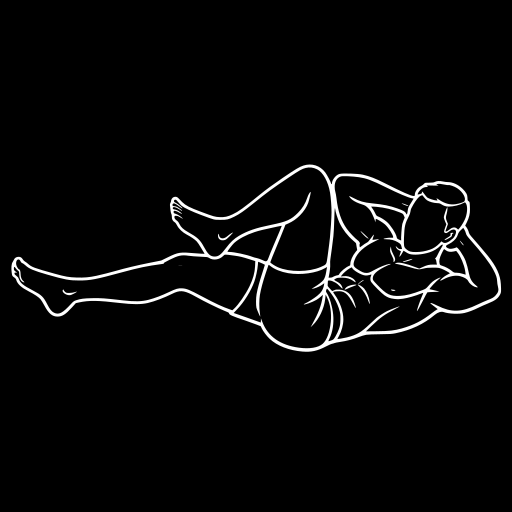

Frame3 now preserves feet-left/head-right camera, with an opposite twist and extended leg; middle is both knees bent. Minor torso rise/contour variation in the opposite twist remains.

## bulgarian-split-squat

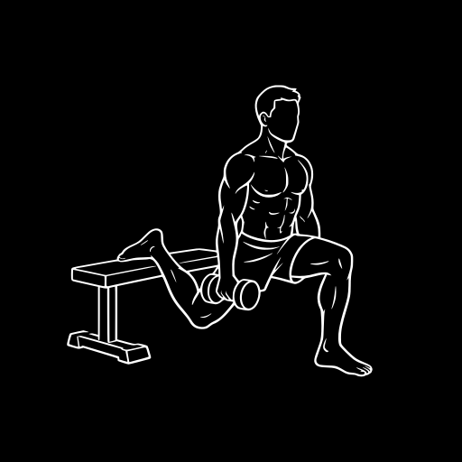

Corrected perspective/contact drift using common contained low scene, fixed-scene native high and revised middle. Head heights progress nearly evenly, foot/bench base alignment maintained. Failed short-bench and too-low midpoint attempts preserved. Small pad occlusion and foot contour differences remain, no qualified form review.

## burpee

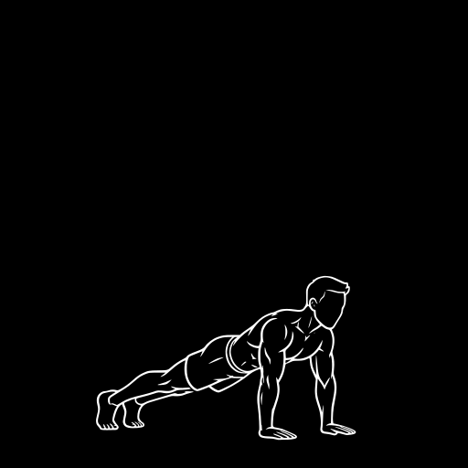

Corrected jumping phase now shares screen-right oblique camera with floor poses. Whole-scene fits match head/limb dimensions and register near/far palms across plank/tuck; jumping feet sit above corresponding floor location. Complete hands/feet and genuine extracted-alpha negative spaces preserved in SVGs. Minor contour variation remains. Worker exact native request provenance for retained floor masters is pending recovery. AI visual review only.

## cable-kickback

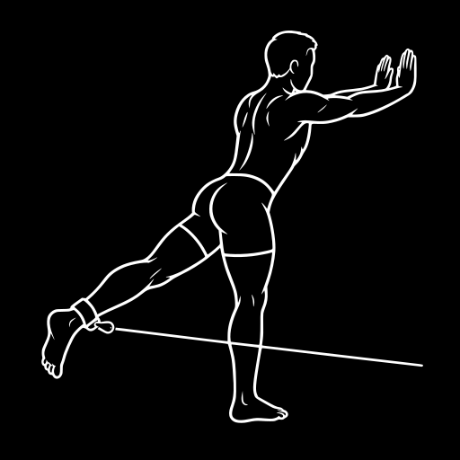

Full/half/neutral return phases now distinct on one registered body/support scene. Regenerated neutral rear foot for complete visible anatomy; ankle cuff and cable foreground crossing retained with fixed far endpoint. Minor leg contours vary; AI visual review only.

## cable-rear-delt-fly

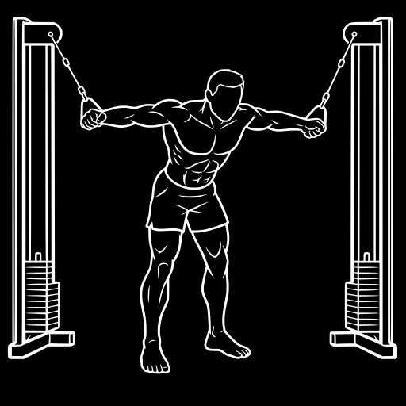

Distinct open/middle/closed arms with broadly registered towers, stance and grips. Minor contour variation. Fresh 512 SVG-wrapper render inspected; same accepted artwork with updated file hashes.

## cable-woodchop

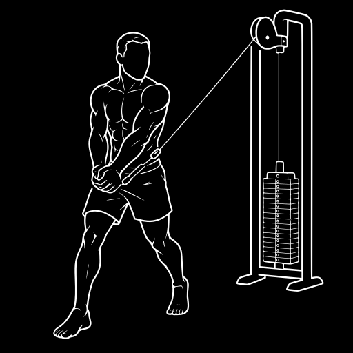

Explicit phase remap produces low/middle/high hand positions with cable attached, complete male anatomy and stable stance/machine framing. Slight machine line-weight/detail variation and head outline change remain. Fresh PNG alpha and actual rendered SVG verified; phase-remap provenance must accompany promotion.

## captains-chair-knee-raise

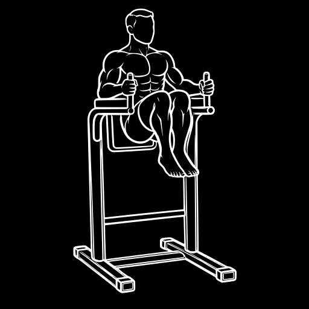

Replaced duplicate phase with distinct half knee raise. All three phases share fixed head, torso and machine dimensions, hands remain on vertical grips and forearms on pads. Small support outline differences persist. PNG/SVG compared; AI visual review only.

## chair-dip

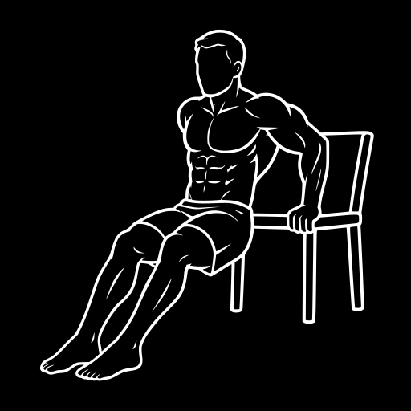

Clear top/middle/lowered phases at broadly stationary chair/hand/heel contacts. Later frames have somewhat bolder linework.

## chest-supported-row

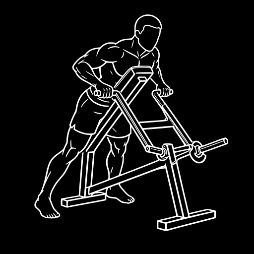

New focused native middle creates clear elbow/handle progression. Head, torso, chest pad and feet stable; intermediate closer to extended endpoint, small machine base/pivot contour differences at3. AI visual review only; no qualified movement review.

## chin-up

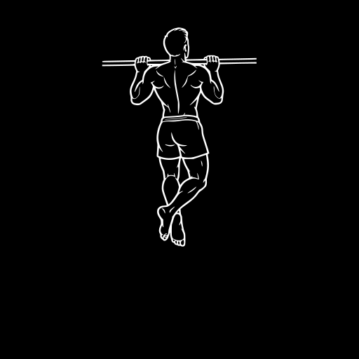

Corrected old top-pose body enlargement, new true midpoint, common canvas and stationary bar/hand contacts across all phases. Head/body dimensions now consistent; crossed ankles retained. Minor hand/contour detail differs. SVG matches PNG; AI visual review, no qualified form approval.

## clamshell

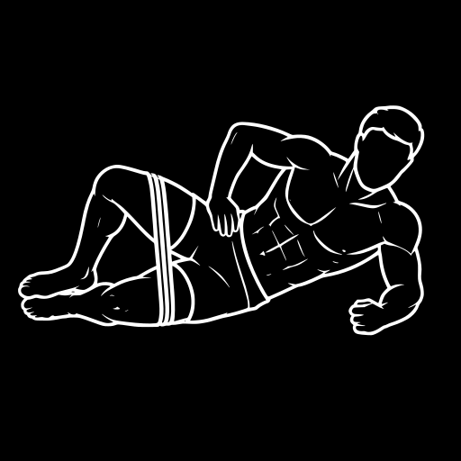

Corrected failed closed/middle phases through focused native edits. Open, halfway and closed knees with fixed supporting forearm, torso, head and touching feet; band follows thigh opening and stays in front. Small contour variations remain; no qualified movement expert review.

## close-grip-lat-pulldown

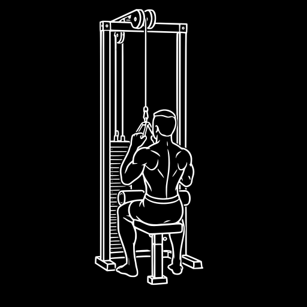

Three distinct contracted/middle/overhead phases match pinned source order. One machine tower, pulley geometry, seat, body, feet and camera persist across frames; arm/handle/cable/stack motion is legible and coherent. Worker contracted frame3 was explicitly remapped to source phase1, with provenance lineage retained. AI visual review only; original worker exact request provenance pending recovery.

## commando-pull-up

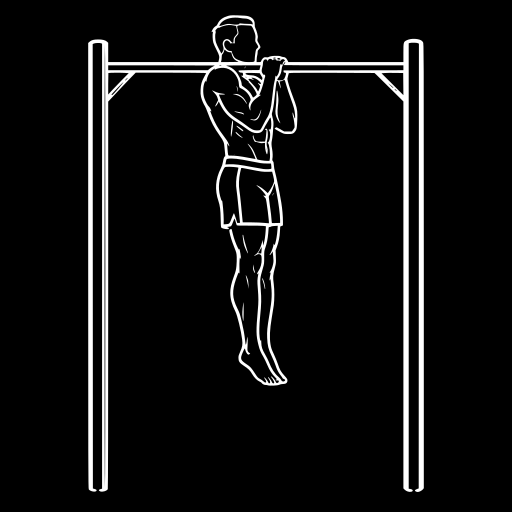

Corrected source-inherited wide frontal overhand depiction to close tandem grip with male facing along bar. Fixed rack/hand contacts persist through top/middle/full-hang; no added overhead loop or cropped feet. Some hand/palm detail is occluded in this view and minor head/torso contours vary. Technique reference stored in sources/commando-mechanics-reference.json; AI visual review only, no qualified movement approval.

## concentration-curl

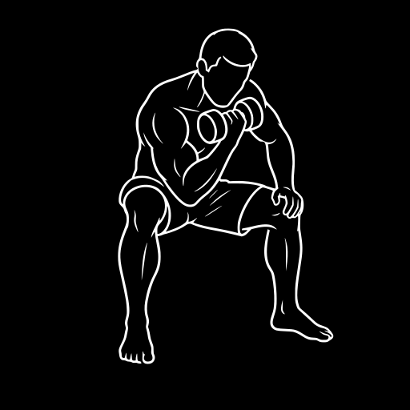

Top/middle/lowered forearm phases, coherent seated body and thigh/elbow relationship. Minor head and dumbbell size variation. Fresh 512 SVG-wrapper render inspected; same accepted artwork with updated file hashes.

## cossack-squat

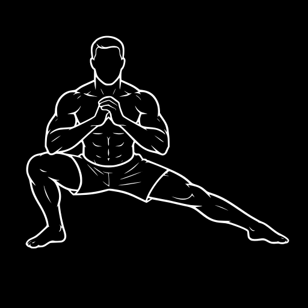

Fixed the middle-frame vertical scene offset with a39px upward whole-scene translation at512; no generation, scaling, cropping or warping. PNG/SVG triptychs inspected: left-loaded/center/opposite-loaded poses share the floor plane. Center pose is slightly broader than endpoints. True selected v2 master retained, AI visual review only.

## crab-walk

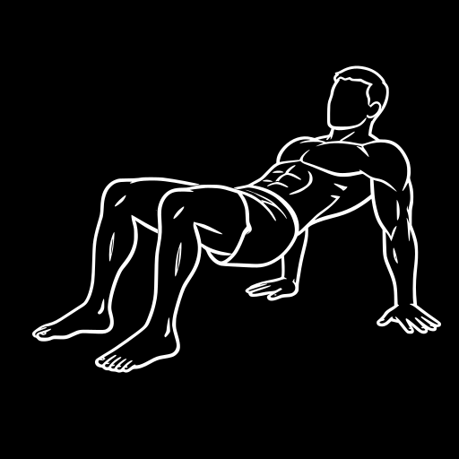

Fresh SVG/PNG: same camera/head/body scale, initial reverse support, contralateral hand/foot lift, then forward contact. Three distinct coherent phases. Small supporting foot shift and hip height changes remain; partial step demonstration rather than full alternating gait cycle. AI visual only, not expert form approval.

## curtsy-lunge

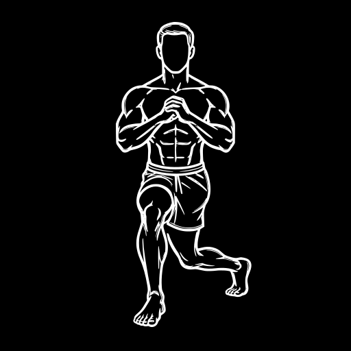

Fresh SVGs do have matching clasped hands. Low/crossed transition/standing phases distinguish by rear leg placement and knee flexion, fixed frontal camera. Middle is closer to low than standing, slight head/foot position variation remains; AI visual review only.

## cycling

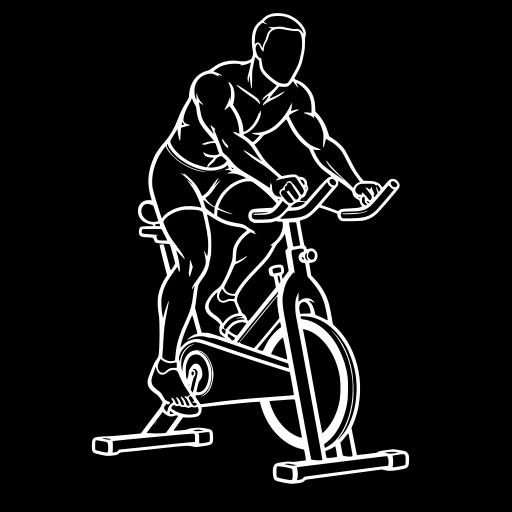

Focused middle edit now preserves bike scene/handle contact. Three leg/pedal placements distinguish a partial pedal stroke, not a full rotation; endpoints are close in angle. Small contours and rear-leg overlap vary, but no major machine/camera jump remains in fresh SVG comparison. AI visual review only.

## dead-bug

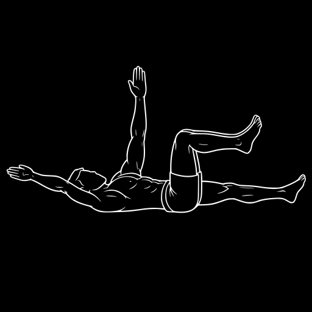

Three complete native poses now share head torso pelvis scale and facing. Extended opposite limbs return through a distinct middle phase to tabletop. SVGs match PNGs with transparent negative spaces. Minor uneven spacing: middle foot is slightly lower before returning to tabletop. AI visual review only; not movement-expert-approved.

## decline-bench-press

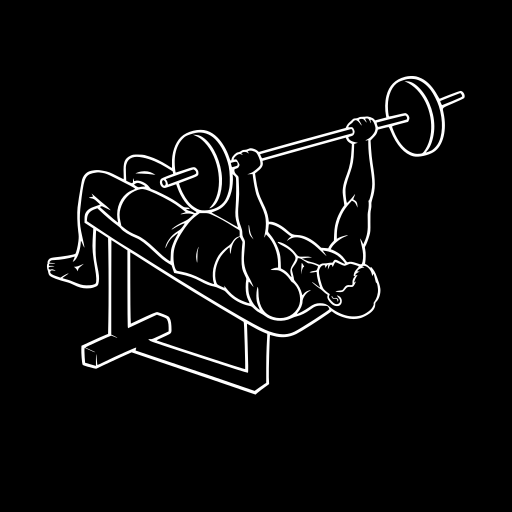

Replaced rotated middle and high head/bench drift using low scene anchor, one target per native request. Fixed full scene and three bar heights; small top bar angle/plate contour variation and unequal phase spacing remain. AI visual review, not movement-expert approval.

## decline-dumbbell-press

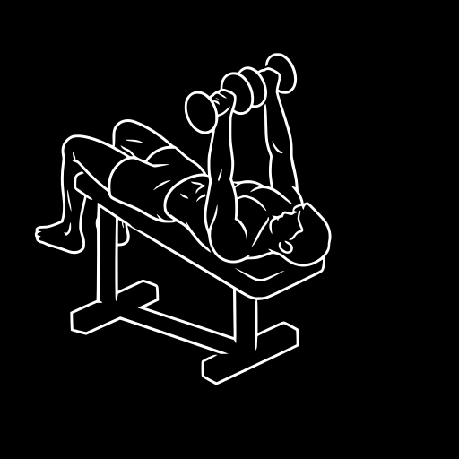

High/intermediate/low press clear with same bench, head, torso, planted feet. Intermediate weight outlines slightly larger than endpoints but no longer tiny. Minor plate/arm contours vary; PNG and SVG alpha reviewed, no expert form approval.

## decline-sit-up

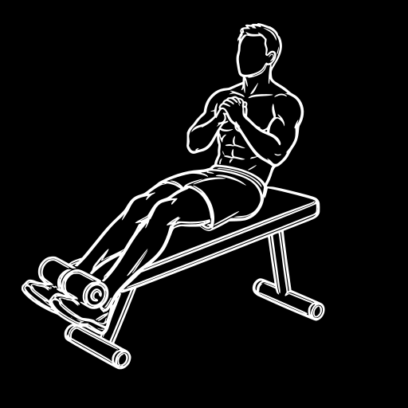

Fresh SVG and PNG review: fixed bench legs and anchored feet across high/middle/low torso angles, consistent clasped hands. Low phase is a partially curled torso rather than fully flat; small outline differences remain. AI visual review only, no expert form approval.

## deficit-reverse-lunge

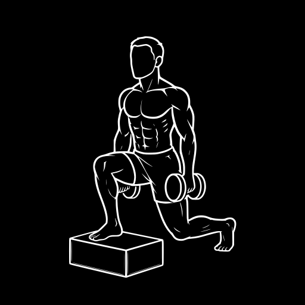

Fresh corrected SVG/PNG: low, middle and standing phases, same demonstrator scale and platform dimensions. Whole-scene translation aligns standing over original front-foot platform position. About6px residual platform height change accepted; complete hair retained and zero border alpha. AI visual only.

## diamond-push-up

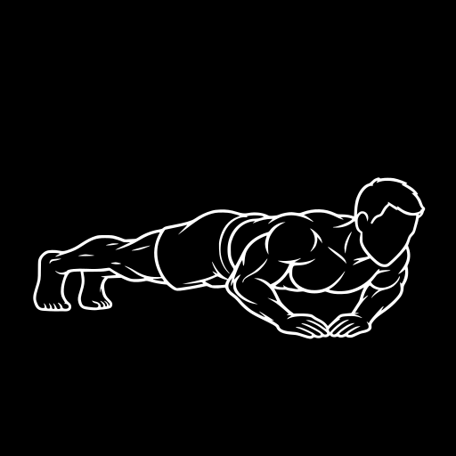

Three distinct bottom/middle/top plank phases in same camera with aligned diamond hands and toes; source duplicated low phase and contact drift corrected. PNG/SVG triptychs inspected, trace preserves all limbs and gaps. 1-2-3-2 playback generated; AI visual review only.

## donkey-kick

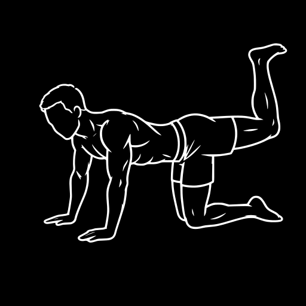

High bent-leg kick, distinct halfway lowered thigh, and knees-down phase share facing and aligned palm contact plane. PNG/SVG triptychs inspected after uniform scene translations, no cropping/warping. Slight head-pitch and supporting-foot contour variation remain; source phase duplication and large camera change repaired. AI visual review only, GIF generated.

## doorway-chest-stretch

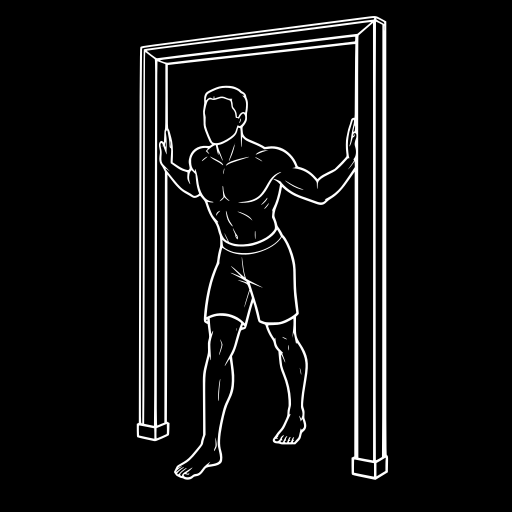

Full lean/middle lean/upright three-phase sequence preserves doorway dimensions/perspective, hand heights and exact staggered feet. Source cross-step/viewpoint changes corrected. PNG/SVG triptychs inspected; small head-height/torso contour variation documented. 1-2-3-2 GIF generated. AI visual review only.

## doorway-row

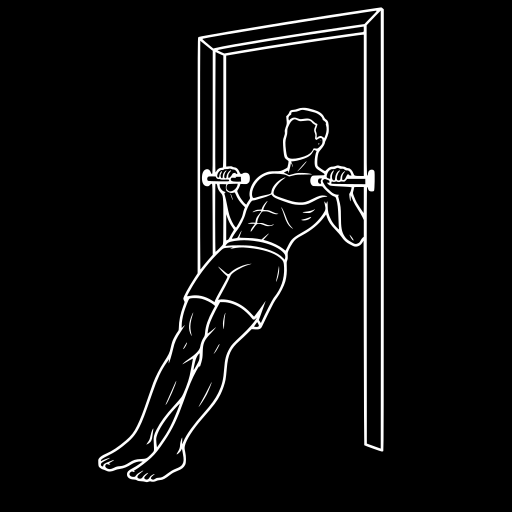

Fresh SVG/PNG: fixed doorway, bar, handgrips and heels after new2/3; distinct bent/intermediate/straight elbow and body angles. Final torso/head outlines appear slightly narrower/foreshortened than raised phase, retained as visual limitation. No qualified movement review.

## dragon-flag

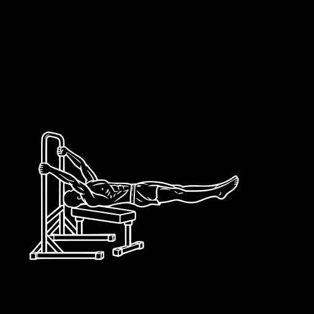

One bench and upright support, fixed handgrips/head/shoulder contact across horizontal/diagonal/high phases. Common canvas preserves scale and leaves rotation space; targeted high-pose edit corrected exaggerated body length. Modest high-phase torso roll/proportion variation remains. SVGs match the normalized PNGs. AI visual review only, not qualified form approval.

## dumbbell-bench-press

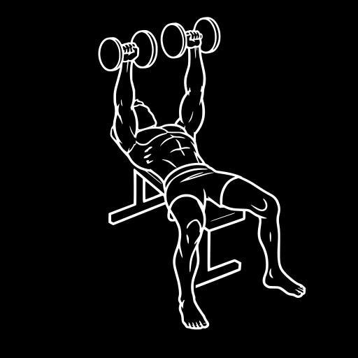

Replaced duplicated middle and mismatched high endpoint from one fixed low scene. Whole-scene translation aligns bench/head/feet; both dumbbells retain scale while arms press upward/inward through three phases. Minor arm/plate contour variation; no qualified form review.

## dumbbell-bent-over-row

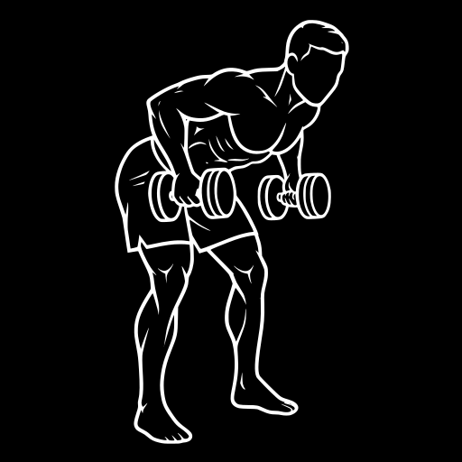

PNG and SVG triptychs inspected: contracted/middle/extended arm chain, stable head, hinge, hips and feet. Fixed dumbbell type and scale; minor contour variation. Source duplicated middle and body drift repaired. Playback GIF generated, AI visual review only.

## dumbbell-fly

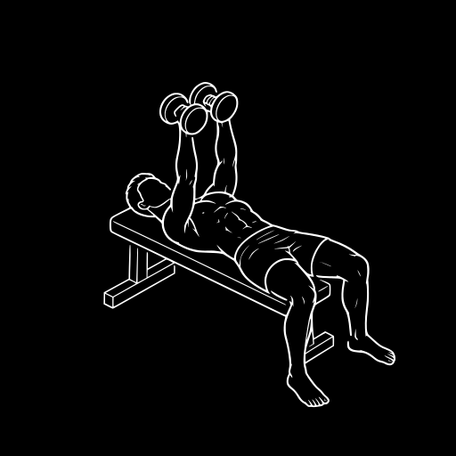

Valid top pose retained, halfway and full-open poses generated with fixed-scene arm edits. Uniform registration compensates full-open native reframing and preserves complete dumbbells. Three phases are distinct with coherent bench/feet and mild elbow flexion. Small head/upper-torso contour variation remains in open pose. Blocked top-generation attempt is archived and not used. AI visual review only.

## dumbbell-hip-thrust

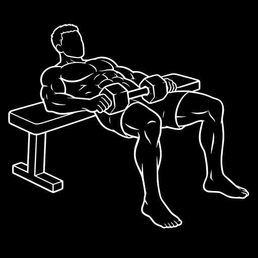

Three distinct hip heights with broadly consistent bench/shoulder support and loaded pelvis. Small foot and head contour/position variation remains.

## goblet-squat

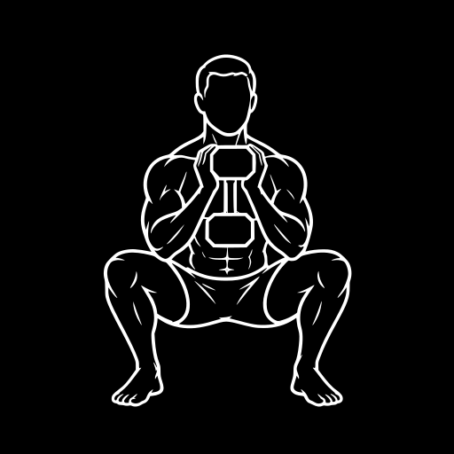

Retry now places middle pelvis and head visibly between deep and standing endpoints with fixed ankles and matching dumbbell. Minor torso/contour variation remains.

## incline-bench-press

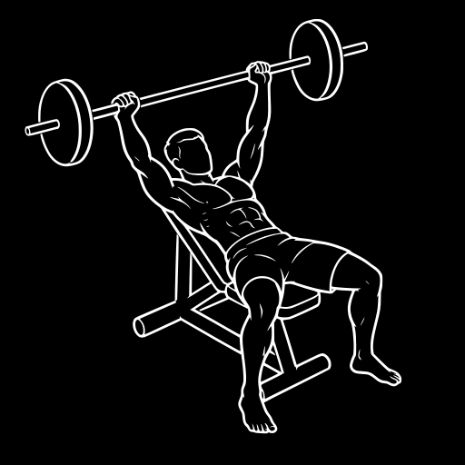

Distinct extended, partial and lowered press phases. Uniform whole-scene translations register retained endpoints and new middle; bench, head and feet align. Small torso/contour variation and unequal phase spacing remain; AI visual review, not qualified movement approval.

## incline-cable-fly

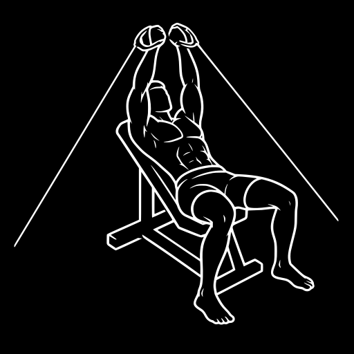

Restored pinned closed-first/open-last ordering; rebuilt one fixed scene with anchored cable directions and three distinct arm positions. Bench, head and feet remain aligned. Midpoint elbow projection/handle outlines vary and right cable endpoint differs slightly; AI visual review only, not qualified movement approval.

## incline-dumbbell-press

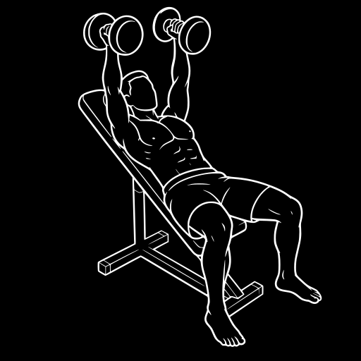

Top/half/lowered phases distinct on one fixed bench, feet and lower body registered. Focused native edit reduced middle head drift; slight upper-torso/head outline variation remains. PNG and SVG visually checked; AI review only.

## incline-push-up

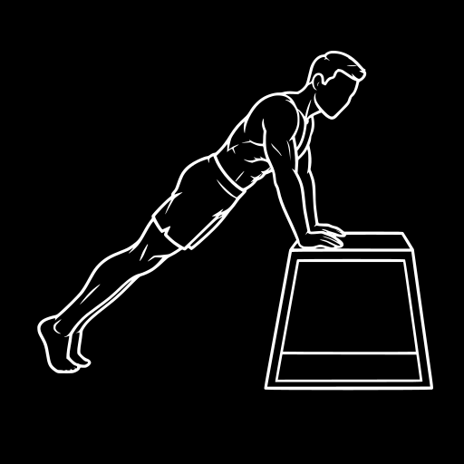

Distinct top/middle/bottom elbow phases; apparatus broadly stable. Minor foot/contact and box-outline variation remains. Fresh 512 SVG-wrapper render inspected; same accepted artwork with updated file hashes.

## romanian-deadlift

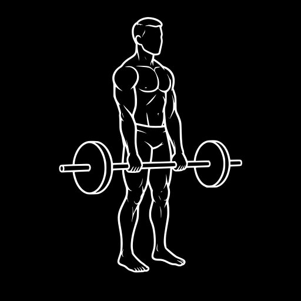

Standing/middle/deep hinge now distinct, bar dimensions broadly stable and stance consistent. Minor contact/contour variation.

## toe-touch

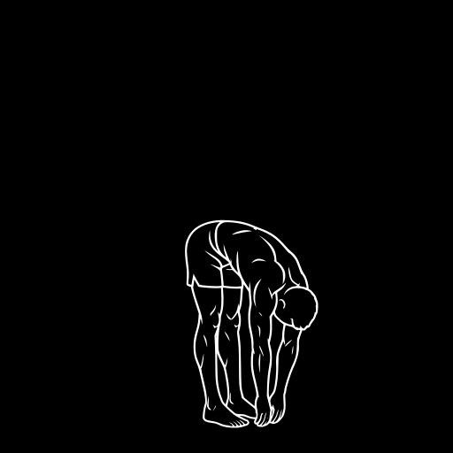

Resolved dominant scale jump deterministically by matching leg lengths and floor to upright3, shrinking overlarge1/2 without crop/stretch/local warping. Frames freshly traced from actual native masters, replacing stale worker-derived pairing. Folded hands reach floor near toes; middle remains a deep hinge. Minor foot/head angles differ. AI visual review only.
