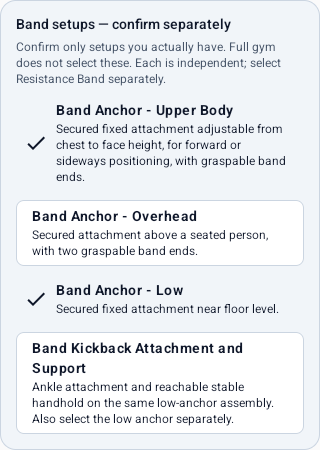
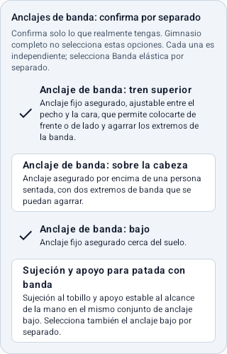

# Fixed-anchor band equipment

Owning a resistance band does not establish an attachment point. Onboarding and
Training Profile collect the following **separate, explicit confirmations**.
Select only setups you have available; Wall, Doorway, Chair, Pull-up Bar, Squat
Rack and the Full gym preset do not confirm any of them.

| Stored canonical identifier | What the confirmation means |
| --- | --- |
| `Band Anchor - Upper Body` | A secured fixed band attachment adjustable from chest through face height, with room to face it or stand side-on and grasp the band ends. This is not an overhead attachment. |
| `Band Anchor - Overhead` | A secured overhead band attachment above a seated person, with two graspable ends. The band and chair are separate selections. |
| `Band Anchor - Low` | A secured fixed band attachment near the floor. It does not establish an ankle connection or body support. |
| `Band Kickback Attachment and Support` | An ankle connection for the band and a reachable stable handhold on the **same low-anchor assembly**. Also select the low anchor and band. An unrelated chair does not supply this setup. |

These are functional setup confirmations, not installation instructions, load
ratings, manufacturer certification or medical guarantees. The app cannot inspect
an anchor, its fastening, the band or the surrounding space. An adjustable setup
may support more than one height, but each available configuration must be
selected explicitly. Full gym preserves confirmations already selected; it never
adds them. Bodyweight only clears the other equipment selections.

  
  

The screenshots show the shared equipment card used by onboarding and Profile,
with upper-body and low setups explicitly selected for illustration.

## Source-bound requirements

The source remains Workout Guide commit
`ba0b709cb20430361b2cb33aaadd20998164a916`. All three PNG and SVG frames for each
of these six IDs were inspected. The source manifest supplies no written
installation instructions. Requirements supplement its original equipment field;
they do not change the ID, source variation, recording type, muscle classification,
provenance or artwork.

| Canonical exercise ID | Complete equipment combination | Evidence and limits |
| --- | --- | --- |
| `banded-face-pull` | Resistance Band + upper-body anchor | Upright attachment appears face-height in frame 1 and upper-chest/shoulder-height in frames 2-3; the adjustable upper-body confirmation covers that range. |
| `banded-pallof-press` | Resistance Band + upper-body anchor | Lateral chest-height attachment, unsupported standing. This is core anti-rotation, not a chest press. |
| `banded-lat-pulldown` | Resistance Band + overhead anchor + Chair | All frames show a seated person, a chair and an overhead ring/loop. The fastening substrate is not shown. It is not a bodyweight hang. |
| `banded-woodchop` | Resistance Band + low anchor | Attachment is near the bottom of the short post. Do not substitute a high-to-low variation based on the name. |
| `banded-kickback` | Resistance Band + low anchor + kickback attachment/support | The ankle connection and the hand gripping the same upright are visible. A low attachment alone is incomplete. |
| `banded-row` | **Unresolved; no automatic eligibility** | The forward attachment is cropped out of every frame. Its height and configuration cannot be established. A comparable standing-row guide is not evidence for the missing fixture. |

Pinned illustrations are under
[`packages/workout-guide/assets/<exercise-id>/frame-{1,2,3}.{png,svg}`](https://github.com/bryllim/workout-guide/tree/ba0b709cb20430361b2cb33aaadd20998164a916/packages/workout-guide/assets).
The [per-ID evidence ledger](research/2026-09-07-full-exercise-catalog-review.json)
retains source observations, non-equipment limitations and held/rejected graph
decisions. Equipment confirmation does not resolve those decisions.

## Eligibility and manual selection

`core/model/ExerciseEquipmentRequirements.kt` contains a bounded six-ID
application-owned correction table. It reuses existing equipment alternatives:
**any complete alternative suffices, but every item within it is required**.
The table validates canonical values and duplicate-free combinations, and catalog
tests bind its exact IDs and source equipment to the pinned bundle.

The table takes precedence over legacy programming requirements and the fallback
source-listed equipment. It does not manufacture a programming record, dose,
fatigue score or starting load. The unresolved row has no satisfiable alternative;
there is deliberately no selectable "unknown anchor" token. Existing empty
legacy matrices keep their previous equipment-free meaning.

The active `ExerciseFilter` uses these effective requirements. The reviewed
`ExerciseEligibilityPolicy` requires both approved equipment alternatives and
the same source-bound minimum, including when considering an available supported
regression. A synthetic or later incomplete approval cannot waive that minimum.
Exclusions and all other applicable eligibility rules still apply.

All 302 entries remain browseable and explicitly selectable in manual templates.
The editor reports missing equipment alternatives or an unresolved setup without
hiding the exercise, changing its variation, adding equipment to the profile or
blocking the existing explicit manual-selection workflow.

Ordinary unanchored band exercises remain available. The band-only legacy pool
changes from 19 to 13 candidates, not to zero. See the
[before/after coverage results](reviewed-catalog-coverage.md#fixed-anchor-enforcement).
This supplies neither a band chest-push exercise nor a workout-focus fix.

## Review and compatibility boundary

No full reviewed metadata proposal is added by this equipment-only correction:
the cohort remains **211 DRAFT / 0 APPROVED**, and
`reviewedCapabilityEligibility=false`. Five runtime equipment minimums are
representable; their full categorical proposals and relationship decisions remain
separate content work. The row's setup itself is still unresolved. Future DRAFT
proposals must use these canonical meanings and retain all other pending evidence
and human decisions. Roadmap Package 3 is not complete.

Canonical identifiers, not translated labels, are stored in the existing profile
equipment list. The normal Room profile mapper and archive codec preserve them
without new fields, migrations or default expansion: **Room remains schema 12;
archives remain format 2 with format 1 restore support**. Old profiles, old saved
onboarding drafts and archives containing only the previous equipment retain
exactly those selections and remain unconfirmed for anchor-dependent work.

Unknown equipment strings in supported archives are preserved as recorded, never
translated into a broader known category or treated as an anchor. The four new
confirmation identifiers require exact canonical spelling; case-changed or
space-padded lookalikes remain inert unknown strings. This keeps every effective
confirmation visible and revocable through Profile. Older equipment retains its
existing case/whitespace matching behavior. Older app
versions may preserve new strings too, but they **do not understand these setup
confirmations or enforce this eligibility correction**; their profile validation
may reject unfamiliar equipment. The unchanged archive version is not a claim
of forward behavioral compatibility. Use a version implementing this contract
for anchor-aware planning after restore.

Profile serializes equipment toggles with its whole-profile capability saves.
Overlapping edits therefore cannot restore a revoked setup from an older
equipment snapshot or discard another setup selected at the same time.
