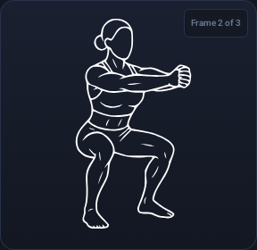
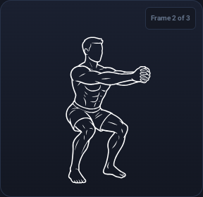

# Exercise illustration variants

WallCrawl bundles 906 female and 906 male SVGs, covering the same 302 exercises as
the [pinned source catalog](../tools/workout-guide/import-config.json). Each is a byte-for-byte copy of the selected
SVG in `art/pilots/female-exercises/catalog` or `male-catalog`.

In onboarding and Profile, gender is optional: Prefer not to say, Woman, Man, or
Nonbinary. This is the only setting that selects artwork: Woman uses the female
set; the other options use the male set. There is no separate illustration override
and no gender control on exercise-image views. Existing users keep unspecified
gender and see male artwork.

Gender is persisted locally in Room and user-requested backups. It does not
participate in exercise eligibility, loads, prescriptions, or workout selection.
Profile changes still advance the existing profile revision.

Every exercise surface shares the preference through `ExerciseIllustration`.
Changing profile gender replaces the whole sequence and restarts its 1–2–3–2 playback. All three
selected frames play, including sequences whose continuity corrections are deferred,
as explicitly requested for this iteration. No still-frame substitution is applied.
If a variant is absent, malformed, or fails to load, the complete pinned original
sequence is used; the renderer never combines male and female frames in one sequence.

The following captures show the real bundled SVGs in the exercise component after
changing the profile gender in the test harness. The component itself contains no
gender control. Both captures show frame 2 of the squat sequence.

| Female artwork | Male artwork |
| --- | --- |
|  |  |

## Packaging

Packaging requires the retained production workspace at
`art/pilots/female-exercises/`, including its selected SVGs and ledgers. The large
masters, source rasters, and generation histories are kept there locally; they are
not included in the integration commit or APK. A normal clone contains the complete
app-ready SVG bundle and its distribution provenance and can build without that
workspace. With the production workspace available, run from the repository root:

```sh
python3 tools/workout-guide/package_illustrations.py
python3 tools/workout-guide/package_illustrations.py --check
```

The packager validates the source pin, complete exercise/frame coverage, selected
SVG hashes, 512×512 viewboxes, and path-only SVG content before writing anything.
It copies only SVGs and distribution metadata to
`app/src/main/assets/exercise-illustrations/`. It does not generate images, retrace
assets, run the upstream importer, modify source artwork, or overwrite the pinned
`workout-guide` bundle. It stops on unexpected stale SVGs rather than deleting them.
The two SVG sets total 54,359,261 uncompressed bytes at initial integration.

The compact `index.json` is the runtime lookup. `provenance.json` records selected
hashes, source paths and attribution, pilot-ledger locations, changes, and review
status. Masters, PNGs, discarded drafts, prompts, and full generation histories
remain in the local pilot directory and are not packaged in the APK. Later corrections
are promoted by rerunning the packager after the selected pilot ledgers are updated.

## Review and licensing

At integration, all frames were produced and individually reviewed by AI. Nine
female pilot frames were user-approved. The male animation review records 252
reviewed sequences and 50 held for further correction; the female catalog does not
have a completed full animation review. These are current drafts, not a claim of
smooth or anatomically perfect animation. Pending isolated candidates are not
silently promoted. No qualified movement-expert approval is claimed.

[Everkinetic](https://github.com/everkinetic/data) is the original pose-artwork
reference. The source catalog also includes additional exercises and animation
frames by [Bryl Lim](https://bryllim.com). Both WallCrawl sets adapt that catalog
at its pinned revision; they are not all direct adaptations of Everkinetic originals.
CC BY-SA 4.0 applies to the artwork and adaptations. Attribution, original-source
URLs, changes, and license text remain bundled and are surfaced through Credits.
The application's MIT license does not relicense the artwork.

The [adaptation notice](../app/src/main/assets/exercise-illustrations/NOTICE.md)
and [original attribution](../app/src/main/assets/exercise-illustrations/ATTRIBUTION.md)
retain the complete source chain. Source pins, immutable source copies, generation
provenance, and historical review records keep their actual project names and paths;
presenting Everkinetic as the artwork reference does not rewrite that history.

## Persistence compatibility

Room migration 12 → 13 preserves existing data and defaults gender to UNSPECIFIED.
The initial integration preview also stored an `illustrationPreference` field. Its
column and archive representation are retained solely for compatibility with that
preview; there is no setter in the UI or repository, and artwork selection ignores
it. Archive format 3 round-trips those legacy values without changing their checksums.
Formats 1 and 2 remain readable with their original canonical checksums and receive
unspecified gender. Newer unknown archive versions are rejected.
