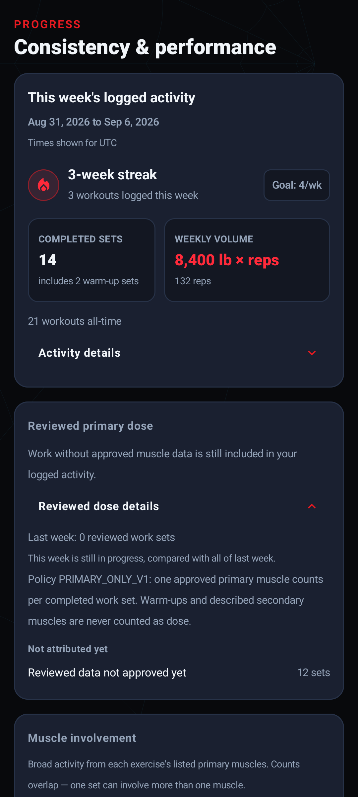
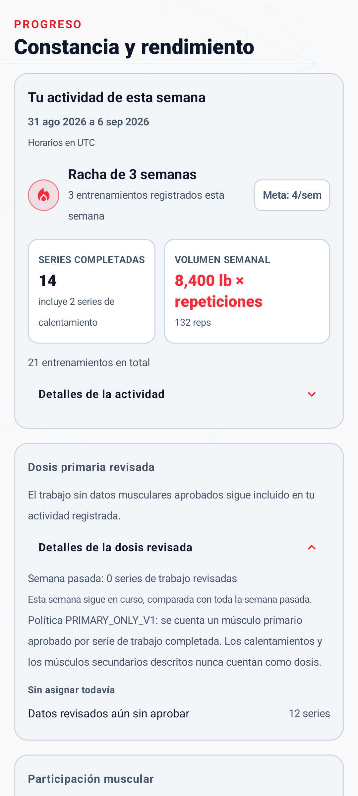

# Weekly dose ledger

WallCrawl reconstructs versioned completed-work-set counts from completed workout history.
This accounting convention is not a complete measurement of physiological stimulus.
The reconstruction is deterministic, versioned, and derived:
nothing increments a stored counter while a workout is generated or a set is logged.

`StateBasedTrainingPolicy` now reads `directPrimarySets` from the ledger to cap future
reviewed prescriptions by remaining weekly allowance. It never treats frequency or
session count as dose, never increases a base prescription, and defines no mandatory
weekly floor. Exact or exceeded allowance returns typed no-guidance instead of zero sets
or over-cap work.

This is per-prescription policy application, not whole-program validation: multiple
proposed exercises can read the same remaining allowance. Roadmap Package 4 must check
the aggregate proposal separately from completed-dose credit. The exact allowances and
`PRIMARY_ONLY_V1`'s single-designated-primary convention are versioned product policies,
not universal physiological laws or medical safety thresholds. Storage/codec bounds are
software limits, not training ceilings. See the
[evidence-to-rule mapping](research/2026-08-29-training-science-evidence-review.md#validation-scope-clarification-2026-09-05).

The prescription consumer is reachable only when
`PlannerFeatureFlags.reviewedCapabilityEligibility` is enabled, which production does
not do. The bundled catalog remains 37 `DRAFT` / 0 `APPROVED`, so current production
planner selection and prescriptions are unchanged. See the
[state-based policy design](superpowers/specs/2026-09-01-state-based-dose-effort-rest-design.md).

Progress also reads the ledger for separately labelled reviewed primary-dose accounting.
This read-side use is independent of the reviewed-planning flag: it neither enables
reviewed generation nor promotes DRAFT metadata. Logged activity remains visible when
reviewed allocation is unavailable.

## `PRIMARY_ONLY_V1`

The policy is named and versioned as `LedgerPolicyVersion.PRIMARY_ONLY_V1`. It credits
exactly one muscle per completed work set:

1. One completed work set credits exactly one approved `directPrimaryMuscle`.
2. Descriptive secondary muscles receive **no dose credit**. They accumulate separately in
   `secondaryInvolvement` for analytics and are never merged into `directPrimarySets`.
3. Fractional secondary crediting is not implemented. It would be a different policy under
   a different version, after reviewed secondary-muscle mapping exists.
4. Body weight, height, BMI, age, RPE, RIR, the "felt manageable" confirmation, readiness,
   and any Health data change nothing about set credit.

## What counts as a completed work set

A set is one completed work set when it is marked completed **and** its type is not
`WARMUP`:

| Set type | Completed | Credit |
| --- | --- | --- |
| `NORMAL`, `DROPSET`, `MYOREP`, `FAILURE` | yes | one work set |
| `WARMUP` | yes | none — warm-ups are preparation, not exposure |
| any type | no | none |

`FAILURE` is historical data about how a set went. It is never an automatic target and
carries no extra weight in the ledger. The classification is an exhaustive `when` over
`SetType`, so adding a set type later fails compilation until it is deliberately credited
or excluded.

Work that was never finished earns nothing: incomplete sets, sets stopped with a typed
`SetStopReason` (including `USER_SKIPPED` and `PAIN_STOP`), cancelled sessions, and
in-progress sessions all contribute zero. Planned target sets and prescriptions are not
exposure and are never counted as such.

## Missing, unknown, and `DRAFT` metadata

A set is credited only when all of the following hold:

- the exercise id resolves **exactly** in the current bundled catalog;
- that exercise carries a `reviewedMetadata` block;
- its `reviewState` is `APPROVED`;
- its `directPrimaryMuscle` is present in the parsed reviewed contract.

Otherwise the work set is counted in `unattributedWorkSets` under a typed reason:

| Reason | Meaning |
| --- | --- |
| `UNKNOWN_EXERCISE` | the id is not in the current bundled catalog |
| `MISSING_REVIEWED_METADATA` | the exercise exists but has no reviewed block |
| `METADATA_NOT_APPROVED` | reviewed metadata exists but is not `APPROVED` |

Nothing is guessed. There is no fallback to legacy `primaryMuscles`, to exercise names, to
the legacy `programming` block, or to an inferred movement pattern. The attribution branch
is a sealed `LedgerAttribution` with exactly two outcomes — credited, or omitted with a
reason — so there is no third path that could invent a muscle.

The bundled catalog currently ships 302 exercises with 37 reviewed entries, **all `DRAFT`
and none `APPROVED`**. Today the ledger therefore credits nothing from real history and
reports every completed work set as `METADATA_NOT_APPROVED` or
`MISSING_REVIEWED_METADATA`. `BundledCatalogLedgerAttributionTest` fails the build if that
changes without deliberate human approval. Tests that need approved metadata build their
own clearly labelled synthetic entries; those fixtures live only in test sources and are
never shipped.

## Week boundary and time zone

A week is one ISO week in a specific zone: Monday at local midnight through the following
Monday at local midnight, exclusive.

- Bounds come from `ZonedDateTime`, never from adding a fixed 168 hours, so a week
  containing a daylight-saving transition spans the 167 or 169 hours that actually
  elapsed.
- `LocalDate.atStartOfDay(zone)` is used deliberately: on a day whose local midnight does
  not exist because the clocks jumped forward, it resolves to the first valid local
  instant of that day.
- Membership uses the session's `completedAtTimestamp` against `[weekStart, nextWeekStart)`
  in epoch milliseconds. The exact start instant is included; the next week's start is
  excluded.
- The ledger records both `weekStartEpochDay` and the exact zone id.
- The zone is part of a ledger's identity. Reading the same calendar week in another zone
  produces a separately reconstructed ledger and its own cache row; an existing snapshot is
  never relabelled.

The current instant comes from an injected `java.time.Clock`, so tests and future callers
control it rather than reading the wall clock implicitly.

## Progress metric contract

The Progress screen is activity-first. **Activity reports what was logged; reviewed primary
dose reports what can be attributed under `PRIMARY_ONLY_V1`.** They are not interchangeable.

All weekly rows below use the same `TrainingWeek` and session `completedAtTimestamp`:
Monday local start-of-day through the following Monday, `[start, end)`, in an explicit
device time zone. `COMPLETED` sessions require a non-null completion timestamp; active and
cancelled sessions are excluded. Sets use their persisted completion flag, not planned
targets. In valid persisted history, stopped/skipped and open sets are incomplete.
Changing app language changes only labels and formatting.

| Metric | Input and attribution | Warm-ups and units | Omissions / interpretation |
| --- | --- | --- | --- |
| Workouts this week | Every completed session in the current range, regardless of catalog coverage or exercise type | One workout, including a session with only warm-ups or timed work | No muscle-metadata dependency; a session can be completed even with no completed sets |
| Completed sets | Each `isCompleted` set in those sessions, counted once | Includes warm-ups and timed sets; units: sets | Open/skipped sets excluded; never obtained by summing muscle involvement |
| Warm-up sets | Completed sets with `SetType.WARMUP` | Subset of completed sets, not extra sets | Explains the difference from completed work sets |
| Repetitions | Positive logged reps from completed `WEIGHT_REPS`, `BODYWEIGHT_REPS` and `ASSISTED_BODYWEIGHT` sets | Includes warm-ups; units: reps; load validity does not determine whether reps count | Missing/nonpositive reps and timed/distance work omitted, never converted to reps; unknown catalog IDs do not erase measurements |
| External-load volume | Sum of finite, nonnegative recorded external load × positive reps from completed `WEIGHT_REPS` sets | Includes warm-ups; convert each session's load into the selected unit, then sum; lb × reps or kg × reps | Missing/invalid load or nonfinite product omitted; body mass, assistance, timed and distance work are not tonnage |
| Legacy primary involvement | One count per completed set per distinct, canonical, trainable legacy primary muscle in the current catalog | Includes warm-ups and timed sets; overlapping per-muscle set counts | Unknown IDs and conditioning tags are omitted from muscle mapping, not from activity totals; multiple muscles can describe the same set |
| Reviewed primary dose | Existing ledger's `directPrimarySets`: one approved direct primary per completed non-warm-up set | Units: completed work sets; FAILURE/DROPSET/MYOREP receive no extra credit | Unknown, missing and DRAFT metadata become typed unattributed work, never legacy-primary fallback |
| Descriptive secondary involvement | Existing ledger's `secondaryInvolvement` from approved mappings | Separate, overlapping counts of the same work sets | Context only, not direct dose or additional completed sets; this says nothing about physiological effect |
| Unattributed work | Existing ledger's `unattributedWorkSets`, grouped by the three typed omission reasons | Completed non-warm-up work sets | Work happened; approved muscle allocation is unavailable. No dose target or warning to make up a supposed deficit |
| Weekly comparison | Current involvement versus the full previous calendar week, over the union of muscles; prior reviewed total comes only from the previous ledger's `creditedWorkSets` | Same metric and attribution on both sides | Involvement percentage is rounded `(current - previous) × 100 / previous` only for positive previous counts; otherwise new activity. Prior reviewed total is a raw count, not an invented percentage. Empty current weeks retain prior detail |
| Weekly streak | Distinct ISO Monday keys across all completed-session timestamps | At least one completed workout qualifies a week, not a frequency or dose target | Count consecutive occupied weeks from current week if occupied, otherwise previous week. An unfinished empty current week has grace; a fully empty previous week breaks it |
| All-time workouts | All completed sessions with non-null completion timestamps | Workouts; no 500-session cap | Independent of muscle mapping or set measurements |
| Records, strength trends and recent history | Existing rules over the latest 500 completed sessions; records/trends require prior valid completed rep-based performances; recent history shows 10 | Existing warm-up treatment retained; record/trend loads converted to selected unit; history retains the session's own unit | First observation is not a record; no strength percentage without a positive prior score. This bounded surface retains its existing `completedAt <= now` filter |

Weekly membership deliberately follows the ledger's full selected calendar range even if
a device clock once recorded a completed timestamp later than the current instant.
Future-week records do not enter this week's metrics. This differs from the preserved
bounded record/trend/history clock filter above; neither range is described as rolling.
Current-versus-previous detail explicitly compares an unfinished week with the entire
previous one, not equal elapsed portions.

For valid history the accounting reconciles:

```text
completed logged sets = completed warm-ups + completed non-warm-up work sets
completed non-warm-up work sets = creditedWorkSets + omittedWorkSets
secondary involvement and legacy primary involvement add no sets to either equality
```

A genuinely empty week, a warm-ups-only week, a week with unattributed completed work,
loading, a deleted/missing local profile, and a repository/catalog failure have distinct
presentation. The all-DRAFT catalog does not produce a "no workouts" state when workouts
exist. Disclosure buttons expose the policy, omissions, prior-week comparison and metric
definitions without competing technical summaries.

<p align="center">
  
  
</p>

These disposable examples contain 14 completed sets, including two warm-ups. The remaining
12 work sets are unattributed, not missing activity; no production metadata was approved.

### Coherent reads and refresh

`OfflineProgressRepository` observes invalidations of profile, session, exercise and set
tables. For each read it samples its injected timestamp provider, resolves the explicit
zone/week, and holds the shared local-data write gate before entering one Room transaction:

```text
profile (read, never bootstrap) + full current/previous ranges + completion timestamps
          + bounded recent history + existing current/previous ledger repository
                               |
                      one ProgressSnapshot
                               |
       logged activity | reviewed primary dose | overlapping involvement
```

The transaction makes activity and dose describe the same history revision. Comparing
ledger fingerprints would not suffice because those fingerprints intentionally exclude
load and repetition measurements. Existing ledger reads may replace derived cache rows;
the gate and in-transaction profile read prevent a late Progress read from rebuilding a
cache after local deletion. No history/profile mutation or archive/schema change is needed.
An absent profile produces `NoProfile`; database, catalog and calculation failures propagate
to Error with Retry, not an empty result.

The complete two-week query is not limited to the 500 sessions retained for heavy
record/trend analytics. Streak/count reads select only completion timestamps, without an
unused sort. Existing ledger representational ceilings still apply and fail explicitly.
Progress ignores cache-table invalidation, so rebuilding its cache does not trigger itself.

Screen collection is RESUMED-only. `WhileSubscribed(0, 0)` stops reads and clears replay
when hidden; a new subscription samples current clock/zone. A single wakeup at the next
week boundary handles rollover without a write. Device time/time-zone changes and Retry
restart the read; Room invalidations cover completion, import and deletion. There is no
periodic Progress query loop. Today also uses `TrainingWeek` for its count range, without
changing planning behavior.

## Reconstruction and cache invalidation

```text
local completed history + bundled approved metadata
  -> weekly range query (whole week, no result limit)
  -> pure WeeklyDoseLedgerCalculator
  -> local reconstructable cache (weekly_dose_ledger_state)
  -> local consumers
```

`WeeklyDoseLedgerCalculator` is pure: no I/O, no clock, no state. It rejects malformed
input loudly and specifically — a session that is not `COMPLETED`, a completion timestamp
outside the requested week, duplicate session, exercise-instance, or set ids, a blank
catalog version, or a negative review-policy version — rather than dropping it and
returning a success-shaped short week. A genuinely empty week returns an explicit empty
ledger. A database or catalog failure propagates; it never becomes an empty week.

`weekly_dose_ledger_state` (added by migration 9 → 10) is a cache, not an authority. It is
keyed by `(profileId, weekStartEpochDay, timeZoneId, policyVersion)` and stores the policy,
catalog, and review-policy versions, the deterministic ledger payload, a source fingerprint,
and a generation timestamp used only for diagnostics.

A cached row is served only when its fingerprint still matches the fingerprint of the
current inputs. `LedgerSourceFingerprint` is a SHA-256 digest, computed with the JDK's
`MessageDigest`, over exactly the inputs that can change credit:

- the included completed session ids and their completion timestamps;
- exercise-instance ids and the catalog exercise ids they reference;
- set ids, types, and completion state (including sets not credited as work);
- for every referenced exercise: whether it resolves, its review state, and — when
  approved — its direct primary, its descriptive secondaries, and its provenance policy
  version;
- the policy version, catalog version, review-policy version, week start, and zone id.

Everything is canonically ordered before hashing, so the same history read back in a
different order can never look like different history. Newly completed work, an approved
entry, a new catalog, a new review policy, a different week, and a different zone all
invalidate the cache and force a recomputation.

Deleting or corrupting the cache cannot change a result. A row that does not decode exactly
reads back as "no usable cache" and the ledger is recomputed from history; a tampered
fingerprint simply fails to match. The cache is replaced wholesale by a freshly computed
ledger and is never incremented, so two concurrent readers of the same week compute the
same ledger and either write leaves the row in the same state.

Migration 9 → 10 is additive. It creates one empty table and reads, rewrites, or drops
nothing: every profile, capability, template, workout, exercise, set, and typed set outcome
keeps the value it already had, and `PRAGMA foreign_key_check` stays clean from every
historically supported schema version.

## Privacy boundary

Ledger reconstruction and cache access run locally. No analytics event, network call,
cloud sync, model prompt, Wear payload, or Health Connect permission is involved.
The cache and its source history share the Room database, which is excluded from
implicit Android backup and device transfer by the app's configuration. See
[Privacy and backup](privacy.md) for the full-domain exclusions, recovery tradeoffs,
OEM transfer limitations, and why this does not erase previously uploaded backups.

The cache is never written to a user-owned export and never read from one: it is
derived, so restoring a stored count would risk serving a number the restored history
does not support. A restore clears the cache and lets the next read rebuild it from
the history it just restored, and deleting all local data removes the cache along with
that history.

The cache and the fingerprint deliberately exclude everything the policy cannot read:
no notes, no free text, no session or exercise names, no RPE or RIR, no "felt manageable"
answer, no loads, repetitions, durations, or distances, no capability answers, and no
profile or body values. The fingerprint is a cache-validity check, not a security control.

Validation messages name the offending field, category, or identifier — never a value the
user typed. Nothing is logged.

## Test commands

Progress coverage adds calendar/activity and lifecycle JVM cases, plus real Room
reconciliation/restore/deletion tests and a Compose language/theme/large-text matrix.
Synthetic approved metadata lives only in tests; the production catalog is unchanged.

```bash
./gradlew testDebugUnitTest --tests '*Progress*Test*' --tests '*TodayViewModelTest*' \
  --tests '*TrainingWeekTest*' --tests '*StringResourceParityTest*' --no-daemon
./gradlew connectedDebugAndroidTest --no-daemon \
  -Pandroid.testInstrumentationRunnerArguments.class=\
wallcrawl.elopenmike.com.core.database.ProgressRepositoryTest,\
wallcrawl.elopenmike.com.feature.progress.ProgressScreenTest
```

```bash
JAVA_HOME=/opt/homebrew/opt/openjdk@17 \
ANDROID_HOME="$HOME/Library/Android/sdk" \
./gradlew testDebugUnitTest --tests '*WeeklyDoseLedger*' \
                            --tests '*TrainingWeekTest*' \
                            --tests '*LedgerSourceFingerprintTest*' \
                            --tests '*BundledCatalogLedgerAttributionTest*' --no-daemon

JAVA_HOME=/opt/homebrew/opt/openjdk@17 \
ANDROID_HOME="$HOME/Library/Android/sdk" \
./gradlew connectedDebugAndroidTest --no-daemon \
  -Pandroid.testInstrumentationRunnerArguments.class=\
wallcrawl.elopenmike.com.core.database.Migration9To10Test,\
wallcrawl.elopenmike.com.core.database.MigrationChainTo10Test,\
wallcrawl.elopenmike.com.core.database.CompletedWorkoutHistoryDaoTest,\
wallcrawl.elopenmike.com.core.database.WeeklyDoseLedgerRepositoryTest
```

The full suites are the usual project commands:

```bash
python3 -m unittest discover -s tools/workout-guide -p 'test_*.py' -v
./gradlew testDebugUnitTest --rerun-tasks --no-daemon
./gradlew lintDebug assembleDebug --stacktrace --no-daemon
./gradlew connectedDebugAndroidTest --no-daemon
git diff --check
```

## Not in this milestone

- Metadata approval of any kind.
- Production enablement of reviewed eligibility or state-based prescription guidance.
- Any new adaptation-state transition; derivation remains limited to `UNCALIBRATED` and
  `RETURNING`.
- Progression, deloads, substitutions, and program blocks.
- Any change to legacy planner selection or prescriptions.
- Fractional secondary-muscle credit.
- Body measurements, BMI, Health Connect, Wear OS, LLM, analytics, or networking.
